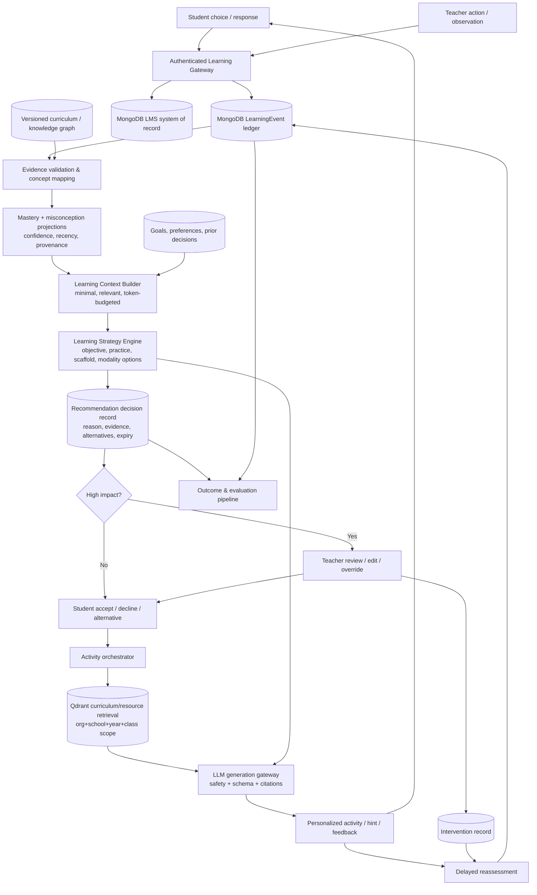

# EEC AI Tutor — Complete Research-Based Audit

**Audit date:** 11 August 2026  
**Scope:** `frontend/`, `backend/`, `ai-service/`, route registration, database schemas, prompts, retrieval, security middleware, schedulers, tests, and relevant documentation.  
**Method:** Static code trace from UI action → API → authorization → structured record/vector payload → decision logic → LLM → persisted outcome. Filenames and comments did not receive credit without executable behavior. No application code or production configuration was changed.  
**Status legend:** `[x] ✅ PRESENT` · `[~] ⚠️ PARTIAL` · `[ ] ❌ MISSING` · `[!] 🔴 CRITICAL`

## 1. Executive Summary

- EEC is **not currently an evidence-based adaptive learning system**. It is a broad LMS with useful AI/RAG, assessment, analytics, and intervention fragments, but it lacks a trustworthy evidence → diagnosis → strategy → activity → reassessment → model-update loop.
- The strongest implemented foundation is the conventional LMS system of record: organizations, schools, academic years, classes, sections, subjects, assignments, exams, results, teacher allocations, parent accounts, teaching materials, and audit logs exist in MongoDB.
- EEC has a genuine RAG path: published teacher documents are parsed, chunked, embedded, stored in Qdrant, filtered at least by `school_id`, and retrieved before tutor generation. The tutor refuses to answer when no source chunks are found.
- That RAG boundary is incomplete. Qdrant payloads omit organization and academic-year identifiers; class/section filters become null because `StudentUser` has no `classId`/`sectionId`; student-language memory retrieval filters only student ID and mode; citations returned by FastAPI are discarded by Express and not shown to students.
- `MasteryScore` is not a defensible mastery model. It stores only one non-decreasing score and an attempt count. Browser-calculated scores from LLM-generated quizzes and student self-ratings can update it; `$max` prevents later contradictory evidence from lowering mastery.
- The AI tutor quiz is generated with answers in the same free-text response, parsed and graded in React, and then sends the resulting percentage to `/api/mastery/update`. There is no authoritative item bank, signed assessment event, attempt record, item calibration, or teacher validation.
- Practice and exam records provide real evidence candidates, but the main practice flow does not update mastery. Exam results update mastery more than once in some flows and collapse an entire subject into one synthetic topic.
- “Misconception detection” currently means repeated wrong responses to the same question or class-wide wrong-answer counts. There is no misconception taxonomy, concept mapping, confidence, teacher validation, or resolution state.
- A separate deterministic recommendation route exists, which is better than delegating every decision to the LLM, but it only uses due dates and fixed mastery thresholds. Recommendations are not persisted, evidence-linked, confidence-scored, goal-aware, rejectable, or outcome-measured.
- Student agency is visibly better than a fixed chatbot: students can choose subjects/topics, ask arbitrary curriculum-grounded questions, request simpler explanations/examples/harder quizzes, use voice input, and keep a journal. They cannot set durable learning goals, explain/reject recommendations, alter teacher paths, or feed reflection into personalization.
- The onboarding `learningStyle` field should **not** be used to match instruction to “visual/auditory/kinesthetic types.” It is presently mostly unused, which avoids a larger evidence conflict. Replace it with task-specific accessibility and modality preferences.
- Teacher dashboards, learning-path publishing, at-risk views, intervention logs, and outcome fields exist. However, teacher allocation is fetched but not enforced in several analytics routes, and AI recommendations have no review/override/evidence workflow.
- Reading, speech, and writing features are substantive prototypes. They store transcripts and multidimensional scores, but they are not connected to the core student/mastery/recommendation model; reading omits comprehension/inference/interest/stamina, and writing often supplies a rewritten answer instead of a hint–revision–reassessment cycle.
- Child safety is insufficient. FastAPI exposes all generation, ingestion, admin, speech, and assessment routes without authentication and allows wildcard CORS. The tutor has a narrow prompt-level content rule but no distress, bullying, abuse-disclosure, self-harm, or human-escalation workflow.
- Document ingestion accepts arbitrary URLs with no host/IP allowlist or download-size cap, creating an SSRF and resource-exhaustion risk if the service is reachable. The service's intended “internal” status is not enforced in code.
- Privacy controls are mixed: JWT/RBAC, a global organization-scoping Mongoose plugin, rate limiting, audit logs, AES-GCM for six fields, consent timestamps, and an erasure endpoint are positive. Yet many highly sensitive child fields remain unencrypted; external OpenRouter calls can receive child content; erasure omits many collections and Qdrant; retention fields are not enforced.
- Engagement is not consistently separated from learning. One scorer queries a nonexistent `engagement` field, another weights client-reported time heavily, and streak nudges treat inactivity as loss of mastery. No valid retention or transfer measures exist.
- Redis is used for rate limits, Socket.IO fan-out, and a student-subject cache—not for a coherent tutor session/active learning context architecture. Background work is in-process cron/fire-and-forget rather than durable jobs.
- LangChain is only a thin model/output-parser wrapper plus embeddings. It is not harmful by itself, but it is not providing orchestration, evaluation, or safety; adding more LangChain would not solve the missing educational architecture.
- Research readiness is very low: there are no experiment assignments, exposure logs, outcome definitions, A/B infrastructure, 5E/EVER evaluation records, or retention/transfer outcomes. Existing timestamps and assessments could seed longitudinal work after evidence integrity is repaired.

## 2. Overall Score

| Category | Score |
|---|---:|
| Architecture | 29/100 |
| Personalization | 31/100 |
| Learning Science | 22/100 |
| AI Safety | 17/100 |
| Teacher Integration | 40/100 |
| Student Agency | 42/100 |
| Data Architecture | 39/100 |
| Research Readiness | 9/100 |
| **Overall** | **29/100** |

The overall score is the unweighted mean rounded from 28.6. Scores reward executed, persistent behavior only. Architecture receives credit for a structured LMS, context builder, RAG, and deterministic recommendation fragments; learning science is held down by invalid mastery and absent concept/evidence models; safety is held down by unauthenticated FastAPI, SSRF, incomplete tenant metadata, and missing child-safeguarding; research readiness is held down by the complete absence of experiment assignment and valid longitudinal outcome infrastructure.

### Audit evidence index

| ID | Primary code evidence | Verified behavior |
|---|---|---|
| E01 | `backend/index.js:532-607` | Registers LMS, AI tutor, mastery, recommendation, analytics, parent, reading/writing routes; does **not** register `baselineRoutes.js`. |
| E02 | `backend/plugins/tenantPlugin.js:1-118`; `backend/middleware/tenantResolver.js`; auth middleware | AsyncLocalStorage organization scoping is applied to Mongoose query/write/aggregate operations when tenant context exists. |
| E03 | `backend/models/StudentUser.js:148-244` | Stores school/campus, grade/section strings, academic-year string, extensive PII, consent timestamps, onboarding preferences; lacks class/section IDs and durable goals. |
| E04 | `backend/models/MasteryScore.js:3-15`; `backend/routes/masteryRoutes.js:75-115,183-215,247-287` | One topic/subject score, attempt count, non-decreasing `$max`; accepts browser score and self-rating evidence. |
| E05 | `frontend/src/components/AITutorHomeScreen.jsx:355-491,3397-3409` | React parses/graduates an LLM answer-bearing quiz, grades it client-side, reveals answer immediately, then posts mastery percentage. |
| E06 | `backend/routes/practiceRoutes.js:467-656`; `backend/models/PracticeAttempt.js` | Authoritative practice items and attempts exist, but do not update mastery; three wrong tries only create a notification. |
| E07 | `backend/services/masteryRouter.js:3-51`; `backend/routes/recommendationRoutes.js:13-108` | Fixed score bands and due schedules determine next action; no durable recommendation/evidence/outcome entity. |
| E08 | `backend/utils/studentContextBuilder.js:1-177` | Builds a selected prompt context from mastery, risk, pace, gaps, progress, LLM memory, and recent messages; inputs are partly invalid/unverified. |
| E09 | `ai-service/app/modules/documents/repository.py:31-205`; `retrieval/service.py:59-203` | Qdrant semantic/chapter retrieval is school-filtered with optional class/section/subject/chapter and source metadata. |
| E10 | `backend/routes/aiTutorRoutes.js:138-260` | Authenticated Node facade loads school materials and student context; missing `StudentUser.classId/sectionId` disables intended lower-scope filters and response drops citations. |
| E11 | `ai-service/app/main.py:55-70`; all FastAPI routers | Wildcard CORS and no authentication/tenant middleware for ingest, delete, tutor, admin, speech, reading/writing, or memory endpoints. |
| E12 | `ai-service/app/modules/documents/service.py:38-48` | Streams any supplied URL to disk with timeout but no scheme/host/private-IP allowlist or byte cap. |
| E13 | `ai-service/app/modules/language_memory/service.py:78-157` | Structured assessment memory is duplicated in Qdrant; `await embed_texts` calls a synchronous function; retrieval lacks school filter and recency ordering. |
| E14 | `backend/routes/teacherAnalyticsRoutes.js:58-123,377-509`; `InterventionLog.js`; `StudentAnalyticsPortal.jsx` | Teacher analytics/intervention UI exists, but allocations are not applied to student filters and outcomes are not evidence-linked. |
| E15 | `ReadingAssessment.js`; `WritingAssessment.js`; `readingAssessmentRoutes.js`; `writingAssessmentRoutes.js`; FastAPI assessment/speech modules | Speech, pronunciation, reading and writing scores/history exist, isolated from mastery and adaptive strategy. |
| E16 | `backend/services/mlEngine.js:22-284`; `services/engagementScorer.js:11-47` | Duplicate heuristic “ML” and engagement logic; no trained/evaluated ML, and one scorer reads a nonexistent material field. |
| E17 | `backend/routes/adminUserManagement.js:1738-1813`; `StudentUser.js:5-129` | Partial encryption and erasure exist; erasure deletes five related collections only and leaves numerous PII/evidence/vector records. |
| E18 | `frontend/src/components/AITutorHomeScreen.jsx:2192-2379`; `MasteryView.jsx:155-180`; `teachers/AILearningPath.jsx:471-520` | Hardcoded goals/insights/recommendations/leaderboards/rewards and mock/error fallbacks can masquerade as learning intelligence. |
| E19 | `ai-service/app/core/config.py:7-46`; `core/llm.py`; assessment/speech services | Declares generation, embedding, summary, assessment, speech, and pronunciation models, but has no model evaluation/cost/latency/fairness registry. |
| E20 | Test commands executed 11 Aug 2026 | Backend: 17/22 suites pass, 89/153 tests pass. Frontend: 8/20 suites pass, 71/160 pass, 9 skipped. Frontend production build completes with JSX and 7.49 MB chunk warnings. Python tests unavailable because pytest is not installed. |

## 3. Master Checklist

Every row provides the required status, evidence, current implementation, problem, recommendation, and priority. “Missing” means no executable implementation was verified; it does not mean no similarly named file exists.

### 3.1 Core EEC AI Tutor principle

| Requirement | Status | Evidence | Current implementation | Problem | Recommended change | Priority |
|---|---|---|---|---|---|---|
| Learning events captured | [!] 🔴 CRITICAL | E04–E06 | Domain-specific attempts/results and chat messages exist. | No canonical immutable `LearningEvent`; AI quiz responses are not stored as evidence. | Add server-authored event envelope with tenant, learner, activity, item/concept, response, support, result, source, timestamp, idempotency. | Critical |
| Student state independent of LLM | [~] ⚠️ PARTIAL | E03, E08 | Identity, progress, mastery, language profile, assessments live in MongoDB. | State is fragmented; prompt-derived memory and invalid mastery are treated as facts. | Introduce a learning-state projection built only from traceable structured evidence. | Critical |
| Knowledge/mastery state independent of LLM | [!] 🔴 CRITICAL | E04 | `MasteryScore` is structured. | It is non-decreasing, browser-writeable, lacks concept graph/confidence/evidence/history. | Replace updates with an evidence-backed concept/skill mastery service. | Critical |
| Learning context represented | [~] ⚠️ PARTIAL | E08 | `buildStudentContext` selects a small profile. | Uses invalid tiers/risk/LLM memory; omits goals, preferences, evidence confidence, prerequisites. | Create versioned `LearningContext` DTO with explicit provenance and token budget. | High |
| Recommendation logic independent of generation | [~] ⚠️ PARTIAL | E07 | Fixed rule service and recommendation route exist. | One score controls difficulty/path; no stored decision or outcomes. | Add a deterministic strategy service over valid mastery, due practice, goals, agency, and safeguards. | Critical |
| LLM is not source of truth | [!] 🔴 CRITICAL | E04, E05, E08 | LMS identity/marks/auth are structured. | LLM-generated questions and summaries influence “mastery,” risk context, and badges. | Prohibit LLM output from directly mutating authoritative state; require validated evidence adapters. | Critical |
| Student responses create evidence | [~] ⚠️ PARTIAL | E05, E06 | Practice/exam/language responses persist; tutor quiz responses do not. | Evidence coverage and schemas are inconsistent. | Route every scored activity through authoritative assessment/event APIs. | Critical |
| Evidence updates student model | [!] 🔴 CRITICAL | E04, E06 | Some exam/AI quiz/self-rating paths update `MasteryScore`. | Valid practice does not; invalid client data does; exam updates can duplicate. | One idempotent evidence consumer updates mastery and projections. | Critical |
| Persistent feedback loop | [!] 🔴 CRITICAL | E04–E08 | Fragments exist across sessions. | No coherent assessment→diagnosis→strategy→activity→reassessment loop. | Build an auditable state machine around events and recommendations. | Critical |
| Explainable AI decisions | [!] 🔴 CRITICAL | E07, E14 | Recommendation strings mention score/date. | No source-event IDs, confidence, decision version, alternatives, or teacher-readable evidence chain. | Persist recommendation reasons and evidence snapshots; render them in teacher/student UI. | Critical |

### 3.2 Student learning model — identity, knowledge, behavior, engagement

| Requirement | Status | Evidence | Current implementation / problem | Recommended change | Priority |
|---|---|---|---|---|---|
| Student | [x] ✅ PRESENT | E03 | `StudentUser` is the structured learner identity. | Keep identity separate from learning-state projections. | Low |
| Organization | [x] ✅ PRESENT | E02, `Organization.js` | Organization model and automatic query scope exist. | Make tenant context mandatory for every non-system database call. | High |
| School | [x] ✅ PRESENT | E03, `School.js` | School reference is pervasive. | Continue explicit school constraints under organization scope. | Medium |
| Academic year | [~] ⚠️ PARTIAL | E03, `AcademicYear.js` | Model exists, but `StudentUser.academicYear` is a string and AI/Qdrant metadata omit year. | Use stable academic-year IDs and propagate them to evidence/RAG/cache keys. | High |
| Class | [~] ⚠️ PARTIAL | E03, `Class.js` | Class model exists; student stores grade string, while AI/material routes expect `classId`. | Add/migrate authoritative enrollment placement; do not duplicate inconsistent labels. | Critical |
| Section | [~] ⚠️ PARTIAL | E03, `Section.js` | Section model exists; student stores section string, routes expect `sectionId`. | Same enrollment projection as class. | Critical |
| Subjects | [x] ✅ PRESENT | `Subject.js`, teacher allocations, E03 | Structured subjects and student choices exist. | Map every assessment item to immutable subject/curriculum IDs. | High |
| Curriculum | [~] ⚠️ PARTIAL | `CurriculumMap.js:3-19` | Embedded ordered topic titles per school/subject/class. | No standard/version/outcomes/concepts/prerequisites. Add versioned curriculum graph. | Critical |
| Chapters/topics | [~] ⚠️ PARTIAL | `CurriculumMap.js`, teaching material strings | Embedded topics and denormalized chapter/topic strings. | Create stable Chapter/Topic/Concept/Skill entities or a single versioned curriculum-node model. | Critical |
| Subject/chapter/concept/skill mastery | [!] 🔴 CRITICAL | E04 | Topic-string score exists; higher levels are ad-hoc averages. | No concept/skill mastery or valid aggregation. Implement evidence-weighted leaf mastery and derived rollups. | Critical |
| Prerequisite relationships | [ ] ❌ MISSING | Curriculum/model scan | Material prerequisites link resources, not knowledge nodes. | Add directed curriculum prerequisite edges with versioning/cycle validation. | Critical |
| Known misconceptions / knowledge gaps | [!] 🔴 CRITICAL | E06, E16 | Wrong-count clusters and low scores are called misconceptions/gaps. | No diagnosis taxonomy or confidence. Add misconception hypotheses tied to concepts and evidence. | Critical |
| Mastery confidence and evidence | [!] 🔴 CRITICAL | E04 | Only score/count/date. | Count is not evidence provenance or confidence. Store evidence references and uncertainty. | Critical |
| Attempts and correct/incorrect answers | [~] ⚠️ PARTIAL | E05, E06, exam models | Practice/exam/language attempts persist; AI tutor attempts do not. | Normalize all scored responses into canonical evidence. | Critical |
| Error patterns | [~] ⚠️ PARTIAL | E06, E14 | Same-question/class wrong-answer counts. | No concept-aware temporal pattern or response-process signal. | Add item/concept/error-code mapping and repeated-pattern queries. | High |
| Hints requested | [ ] ❌ MISSING | Tutor UI/persistence scan | Socratic/help prompts exist but hint events are not structured. | Log hint level, timing, and whether performance later improves. | High |
| Retries | [~] ⚠️ PARTIAL | Practice attempts; E05 | Practice creates repeated rows; tutor retry resets locally. | Add attempt sequence/activity IDs and distinguish immediate retry from delayed reassessment. | High |
| Revision behavior | [~] ⚠️ PARTIAL | journal/writing UI | Journal and new writing submissions exist. | No revision lineage or before/after learning evidence. | Add revision parent IDs, changed spans, feedback exposure, and rescore. | High |
| Self-correction | [ ] ❌ MISSING | Assessment/UI scan | Not separately recorded. | Log answer-change/self-explanation events before feedback. | Medium |
| Task completion | [~] ⚠️ PARTIAL | materials, assignments, lesson plans | Many completion flags exist, some student self-reported. | Mark source and verification level; completion must not imply learning. | High |
| Persistence / abandonment | [ ] ❌ MISSING | Event/model scan | No canonical start/abandon/resume semantics. | Derive situational persistence from event sequences; never make a trait label. | Medium |
| Practice frequency | [~] ⚠️ PARTIAL | timestamps, E16 | Can be approximated from attempts; some “session” rates use attempt counts. | Compute from canonical session/event boundaries. | Medium |
| Engagement distinct from mastery | [!] 🔴 CRITICAL | E16 | Separate endpoints exist, but time/views affect “gaps,” and nudges say mastery is waiting. | Define engagement as non-outcome context; never promote mastery without assessment evidence. | Critical |
| Retention | [ ] ❌ MISSING | SR schedule scan | Review reminders exist, no delayed outcome measure. | Create delayed, unprompted reassessment outcomes. | High |
| Transfer | [ ] ❌ MISSING | Assessment scan | No novel-context/near/far transfer tags or outcomes. | Add transfer item metadata and separate outcome metrics. | High |
| Assessment performance | [x] ✅ PRESENT | exam/practice/reading/writing models | Multiple assessment records exist. | Validate and map to concepts; keep separate from latent mastery. | High |
| Activity participation / task completion / interaction | [~] ⚠️ PARTIAL | material engagement arrays, attempts | Logged inconsistently and partly client-supplied. | Canonicalize as engagement events with trust level. | High |
| Voluntary practice | [ ] ❌ MISSING | event scan | Assigned and voluntary activity are not distinguished. | Add initiator/assignment linkage. | Medium |
| Student self-report | [~] ⚠️ PARTIAL | mastery lesson self-rating, journal mood | Self-report exists but is incorrectly converted to mastery. | Store metacognitive confidence/mood separately from knowledge evidence. | Critical |
| Session continuity | [~] ⚠️ PARTIAL | `TutorConversation`, `StudentMemorySummary` | Chats persist and recent turns are reused. | Add real learning-session boundaries, deletion propagation, evidence-safe summaries. | High |
| “More time = more learning” safeguard | [!] 🔴 CRITICAL | E16 | No explicit safeguard; time has 35–40% engagement weight. | Label time as engagement only and test learning with valid outcomes. | Critical |

### 3.3 Student agency

| Requirement | Status | Evidence | Current implementation / problem | Recommended change | Priority |
|---|---|---|---|---|---|
| Select topics | [x] ✅ PRESENT | `AITutorHomeScreen.jsx` topic controls | Students choose among published subjects/topics. | Preserve choice and record it as context, not ability. | Low |
| Select goals | [ ] ❌ MISSING | E03, E18 | “Daily goals” are hardcoded UI; no `StudentGoal`. | Add student-authored goals with scope, horizon, status, and teacher visibility. | High |
| Request additional/easier explanation or another example | [x] ✅ PRESENT | Tutor mode chips/prompts | Simpler explanation and examples are directly requestable. | Track help request and downstream success, without penalizing learner. | Medium |
| Request harder challenge | [x] ✅ PRESENT | Tutor quiz difficulty/modes | Harder/advanced practice is selectable. | Use validated items and safe challenge bounds. | High |
| Select modality | [~] ⚠️ PARTIAL | Tutor modes, voice input, E03 | Text formats and speech input exist; no TTS/audio lesson/interactive parity. | Offer accessibility-driven modality choices and log preference per task. | Medium |
| Ask outside recommended path | [x] ✅ PRESENT | Tutor free question | Any grounded curriculum question can be asked. | Keep school/curriculum boundaries and safety escalation. | Low |
| Reject/change AI recommendation | [ ] ❌ MISSING | E07, UI scan | Recommendations can be ignored but not rejected/explained/changed. | Add accept, snooze, reject, alternative, and reason controls. | High |
| Reflect on learning | [~] ⚠️ PARTIAL | `StudentJournalEntry.js`; `AssignmentView.jsx` | Journal/mood/tags persist. | Add optional structured reflection linked to activity; do not mine sensitive diary text by default. | Medium |
| See meaningful progress | [!] 🔴 CRITICAL | Mastery UI, E04, E18 | Progress is visible but built on invalid mastery and sometimes demo data. | Show evidence-backed trends, uncertainty, and “insufficient evidence.” | Critical |
| Avoid automatic decisions/fixed path | [~] ⚠️ PARTIAL | teacher-published paths, free tutor | Free choice exists; teacher path unlocks automatically on score and student completion. | Make recommendations optional; require evidence/teacher decision for high-impact paths. | High |
| Avoid permanent weak/strong labels | [!] 🔴 CRITICAL | `StudentProgress.isWeakStudent`; context “AT-RISK” | Persistent boolean and fixed tiers label learners. | Replace with time-bounded, evidence-specific “needs support on X” hypotheses. | Critical |
| Avoid deterministic potential predictions | [!] 🔴 CRITICAL | E16 `estimatedWeeksToTarget`; at-risk routes | Heuristic pace/risk is presented without validation/uncertainty. | Remove predictive language until calibrated; expose uncertainty and human review. | Critical |

### 3.4 Personalization engine

| Dimension | Status | Evidence | Current implementation / problem | Recommended change | Priority |
|---|---|---|---|---|---|
| Content | [~] ⚠️ PARTIAL | E07–E10 | Subject/topic/material selection changes content. | Base selection on valid concepts, prerequisites, goals, due practice, and choice. | High |
| Difficulty | [!] 🔴 CRITICAL | E04, E07 | Fixed thresholds over invalid non-decreasing score; LLM generates unvalidated difficulty. | Calibrate item difficulty and strategy rules independently of generation. | Critical |
| Scaffolding | [~] ⚠️ PARTIAL | Socratic homework prompt, simpler/example modes | User-selected help exists; no adaptive hint ladder/evidence. | Implement hint levels and fade support based on response evidence. | High |
| Text | [x] ✅ PRESENT | Tutor and materials | Text generation/retrieval is the primary modality. | Preserve source citations and grade-appropriate validation. | Medium |
| Visual | [~] ⚠️ PARTIAL | mind-map outline/UI assets | “Mind map” is a nested text outline; no generated/validated instructional visuals. | Use curated or accessible visuals only where conceptually useful. | Medium |
| Audio | [~] ⚠️ PARTIAL | speech/reading modules | Audio input and oral reading exist; no tutor TTS/adaptive audio lessons. | Add age/accessibility appropriate playback only if evaluated. | Medium |
| Interactive | [~] ⚠️ PARTIAL | quizzes, games, simulations | Many interactive surfaces, several hardcoded or disconnected from evidence. | Register activities and outcomes through the event/evidence layer. | High |
| Example-based | [x] ✅ PRESENT | prompt modes | Examples and real-world connections can be requested. | Evaluate whether examples improve later independent performance. | Medium |
| Pace | [!] 🔴 CRITICAL | E16 | Heuristic weeks-to-target from score/attempt count. | Use learner-controlled pacing, due windows, workload constraints, and uncertainty—not ability prediction. | Critical |
| Context/interests | [~] ⚠️ PARTIAL | real-world mode, subject preferences | Real-world examples are source-bound; interests are not modeled safely. | Let learner choose temporary context/interests; do not infer sensitive traits. | Medium |
| Feedback style | [~] ⚠️ PARTIAL | prompt modes, language tier | Warm/Socratic/short feedback prompts exist. | Select a pedagogical feedback policy from evidence and learner choice, not an LLM-inferred “style.” | High |
| Practice selection | [~] ⚠️ PARTIAL | E07, SR | Due/weak/new topics are selected by fixed score rules. | Use valid mastery uncertainty, spacing, interleaving, prerequisite and goal constraints. | Critical |
| Goals | [ ] ❌ MISSING | goal scan | No durable learning goals feed decisions. | Add goal service and strategy constraint. | High |
| Agency influences personalization | [~] ⚠️ PARTIAL | subject/topic/mode selections | Immediate choices influence prompts, but not the longitudinal strategy. | Persist choice/decline feedback and offer alternatives. | High |
| Personalization beyond “easier question” | [!] 🔴 CRITICAL | E07–E08 | Some content/mode changes exist, but core engine remains score-band difficulty. | Implement multidimensional strategy policies with measurable outcomes. | Critical |

### 3.5 Knowledge/mastery model

| Requirement | Status | Evidence | Current implementation / problem | Recommended change | Priority |
|---|---|---|---|---|---|
| Concept-, skill-, chapter-, subject-level mastery | [!] 🔴 CRITICAL | E04, CurriculumMap | Only topic-string score; chapter/subject are display strings/averages. | Stable knowledge nodes; leaf mastery plus provenance-preserving rollups. | Critical |
| Confidence score | [ ] ❌ MISSING | `MasteryScore.js` | No uncertainty/confidence. | Calculate posterior/credible interval or calibrated evidence-strength tier. | Critical |
| Evidence count | [~] ⚠️ PARTIAL | E04 | `attemptCount` exists. | It counts updates, not unique valid evidence and can double count. | Store immutable evidence IDs and effective sample size. | Critical |
| Recency | [~] ⚠️ PARTIAL | `lastUpdated` | One latest timestamp. | Retain evidence timeline and apply evidence-specific recency/retention logic. | High |
| Historical performance | [ ] ❌ MISSING | E04 | Old scores are overwritten. | Append mastery snapshots or deterministically rebuild from events. | Critical |
| Prerequisite graph | [ ] ❌ MISSING | model scan | No knowledge prerequisite graph. | Versioned directed edges between curriculum nodes. | Critical |
| Misconception tracking | [!] 🔴 CRITICAL | E06 | Notifications and aggregates only. | First-class hypothesis, evidence, confidence, validator, status, resolution evidence. | Critical |
| Mastery update mechanism | [!] 🔴 CRITICAL | E04–E05 | Browser/self-rating/exam updates, `$max`, duplicated pathways. | Only server-side validated evidence adapters may call one idempotent engine. | Critical |
| Algorithm/formula | [!] 🔴 CRITICAL | `masteryRoutes.js:84-100` | `final=max(stored, .7×stored+.3×new)` after `$max`; score never declines. `computeWeightedMastery` rescales a single score and is not an EMA. | Start with transparent evidence-weighted Bayesian/log-odds or calibrated rule model; evaluate before complexity. | Critical |
| Signals/update frequency | [!] 🔴 CRITICAL | E04–E06 | AI quiz finish, lesson self-rating, and exam hooks; valid practice omitted; some exams update twice. | Consume each immutable scored event exactly once with signal reliability weights. | Critical |
| Contradictory evidence | [!] 🔴 CRITICAL | E04 | Lower results cannot reduce score. | Permit posterior decrease while separating short-term lapse, retention, and uncertainty. | Critical |
| Insufficient evidence | [!] 🔴 CRITICAL | E07–E08 | Missing data defaults to foundation/0 and receives recommendations. | Return `unknown/insufficient evidence`, require minimum coverage, ask diagnostic items. | Critical |

### 3.6 Misconception detection

| Requirement | Status | Evidence | Current implementation / problem | Recommended change | Priority |
|---|---|---|---|---|---|
| Error classification | [ ] ❌ MISSING | E06 | Correctness only; no diagnostic error codes. | Map distractors/response patterns to candidate misconceptions. | Critical |
| Concept mapping | [ ] ❌ MISSING | `PracticeQuestion.js` | Practice question has subject ID but no concept/skill IDs. | Require versioned concept mappings for diagnostic items. | Critical |
| Misconception identification | [!] 🔴 CRITICAL | E06, prompt mode | LLM is asked to speculate after a wrong answer; no structured diagnosis. | Generate a hypothesis only from mapped patterns; keep LLM explanatory, not authoritative. | Critical |
| Repeated error detection | [~] ⚠️ PARTIAL | E06, E14 | Counts wrong same-question/class responses. | Detect repeated *pattern across multiple items/sessions*, not question memorization. | High |
| Teacher validation | [ ] ❌ MISSING | teacher UI scan | No approve/reject/edit state. | Add teacher review queue and validation provenance. | Critical |
| Confidence | [ ] ❌ MISSING | model scan | No calibrated diagnostic confidence. | Derive from discriminating evidence and validation history. | Critical |
| Resolution tracking | [ ] ❌ MISSING | model scan | No open/resolved/recurred state. | Close only after delayed reassessment contradicts the hypothesis. | High |

### 3.7 Adaptive learning loop

| Step | Status | Evidence | Current implementation / problem | Recommended change | Priority |
|---|---|---|---|---|---|
| Assessment | [~] ⚠️ PARTIAL | exams/practice/language, E05 | Many assessment types; tutor quiz unvalidated and baseline route dead. | Classify purpose and validate item/evidence source. | Critical |
| Diagnosis | [!] 🔴 CRITICAL | E04, E06 | Low score/wrong count masquerades as diagnosis. | Concept mastery plus misconception hypothesis service. | Critical |
| Recommendation | [~] ⚠️ PARTIAL | E07 | Ephemeral fixed rules. | Persist explainable recommendation with alternatives/expiry/outcome. | Critical |
| Activity generation | [~] ⚠️ PARTIAL | E09–E10 | Grounded LLM content modes exist. | Generate from selected strategy and validated learning objective/schema. | High |
| Feedback | [~] ⚠️ PARTIAL | Socratic mode, E05 | Good homework prompt, but quiz reveals answer immediately. | Implement hint→retry→explain→example→retry. | High |
| Reassessment | [ ] ❌ MISSING | flow trace | Retry exists locally; no scheduled independent reassessment linked to intervention. | Create delayed/equivalent-form reassessment events. | Critical |
| Model update | [!] 🔴 CRITICAL | E04 | Incorrect partial update exists. | Single idempotent evidence consumer. | Critical |
| Cross-session persistence | [~] ⚠️ PARTIAL | Mongo records, conversations | Fragments persist, loop state/recommendation exposure does not. | Persist session, recommendation, activity, outcome and model version. | Critical |

### 3.8 Learning strategy engine

| Decision | Status | Evidence | Current implementation / problem | Recommended change | Priority |
|---|---|---|---|---|---|
| What to study next / move topic | [~] ⚠️ PARTIAL | E07, teacher paths | Fixed bands/paths; no prerequisites/goals/choice. | Policy engine with valid knowledge graph and agency constraints. | Critical |
| Review timing | [~] ⚠️ PARTIAL | spaced repetition routes/cron | Fixed `[1,3,7,14,30]`, inconsistent 0–1 vs 0–100 inputs, repeated nudges. | One evidence-driven scheduler with recall outcome and idempotent notifications. | High |
| Increase difficulty | [!] 🔴 CRITICAL | E07 | Threshold over invalid mastery. | Require sufficient evidence and calibrated item difficulty. | Critical |
| Provide scaffolding | [~] ⚠️ PARTIAL | prompts | User-selected, not evidence-adaptive. | Choose/fade hint level; retain learner override. | High |
| Revisit prerequisite | [ ] ❌ MISSING | graph scan | No prerequisite graph. | Traverse unmet prerequisite evidence. | Critical |
| Additional practice | [~] ⚠️ PARTIAL | E07 | Weak-score practice recommendation. | Select diverse mapped items and stop based on uncertainty/outcomes. | High |
| Notify teacher | [~] ⚠️ PARTIAL | `masteryEngine.alertTeacherIfStuck` | Threshold alert exists; based on invalid mastery and swallowed errors. | Evidence bundle, confidence, teacher allocation, acknowledgment, outcome. | Critical |
| Recommend offline activity | [ ] ❌ MISSING | real-world mode | Gives examples, not device-off structured activities/outcome tracking. | Add safe teacher/parent-approved offline activity templates. | Medium |
| LLM not sole decision-maker | [~] ⚠️ PARTIAL | E07 | Deterministic layer exists. | Expand it; LLM should verbalize selected strategy only. | Critical |

### 3.9 Teacher + AI collaboration

| Requirement | Status | Evidence | Current implementation / problem | Recommended change | Priority |
|---|---|---|---|---|---|
| Teacher dashboard | [x] ✅ PRESENT | E14, `StudentAnalyticsPortal.jsx` | At-risk, gaps, trends, mastery, interventions are visible. | Fix evidence and authorization before operational use. | Critical |
| AI recommendations | [~] ⚠️ PARTIAL | AI summaries/path generation | AI generates plans/narratives; no durable recommendation record. | Persist proposed recommendation separate from approved intervention. | High |
| Evidence behind recommendation | [!] 🔴 CRITICAL | E07, E14 | Aggregated scores/text only; no source event trail. | Show evidence IDs, dates, trend, counter-evidence, confidence. | Critical |
| Teacher approval | [~] ⚠️ PARTIAL | learning-path publish | Teachers publish paths; other AI intervention text has no approval workflow. | Unified approve/edit/reject workflow for high-impact recommendations. | Critical |
| Teacher override | [ ] ❌ MISSING | model/UI scan | No decision override record/reason. | Versioned override with rationale and expiration. | High |
| Teacher comments | [~] ⚠️ PARTIAL | intervention notes, observations | Notes exist but are not attached to AI decision/model feedback. | Link comments to recommendation/intervention/evidence. | Medium |
| Intervention tracking | [~] ⚠️ PARTIAL | `InterventionLog.js`, E14 | Action/status/outcome/improvement exist. | Add trigger, evidence refs, recommendation, approval, dates, follow-up assessment. | Critical |
| Intervention outcome | [~] ⚠️ PARTIAL | E14 | Teacher enters free text/percent. | Compute objective baseline/post outcomes and retain teacher qualitative notes separately. | High |
| Teacher feedback to AI/model | [ ] ❌ MISSING | `TeacherFeedback.js` is student→teacher | No validation signal enters AI/student model. | Store recommendation usefulness and diagnosis validation; never silently retrain. | High |
| Human decision-maker | [!] 🔴 CRITICAL | at-risk/weak flows | Teacher sees outputs, but automatic labels/path unlocks/badges and AI risk prose can drive action. | Gate high-impact educational/wellbeing decisions behind accountable humans. | Critical |

### 3.10 AI explainability

| Requirement | Status | Evidence | Current implementation / problem | Recommended change | Priority |
|---|---|---|---|---|---|
| Recommendation reason | [~] ⚠️ PARTIAL | E07 | One sentence from score/due date. | Structured reason code plus readable explanation. | High |
| Supporting evidence | [!] 🔴 CRITICAL | E07 | No evidence references. | Immutable event IDs and snapshot. | Critical |
| Confidence | [ ] ❌ MISSING | schema scan | No uncertainty. | Calibrated confidence/evidence-strength. | Critical |
| Data timestamp | [~] ⚠️ PARTIAL | mastery/due records | Source dates exist but are not included in recommendation payload. | Return event timestamps and decision `asOf`. | High |
| Source events | [ ] ❌ MISSING | no LearningEvent | Cannot trace. | Canonical event ledger and decision provenance. | Critical |
| Teacher-readable explanation | [~] ⚠️ PARTIAL | dashboards/AI prose | Readable but ungrounded in traceable evidence. | Template explanation from structured decision; LLM optional for wording. | Critical |

### 3.11 RAG architecture and quality

| Requirement | Status | Evidence | Current implementation / problem | Recommended change | Priority |
|---|---|---|---|---|---|
| MongoDB as system of record | [~] ⚠️ PARTIAL | DB model inventory | Strong LMS records; missing learning event/goal/recommendation/concept evidence entities. | Keep structured state in MongoDB and add missing entities. | Critical |
| Students / academic structure / assessments / questions / assignments / exams | [x] ✅ PRESENT | model inventory | All have structured models, though quality varies. | Normalize IDs and concept metadata. | High |
| Attempts | [~] ⚠️ PARTIAL | Practice/Exam/Baseline/Tryout results | Multiple incompatible attempt schemas; tutor attempt absent. | Canonical evidence envelope over domain records. | Critical |
| Learning sessions | [ ] ❌ MISSING | model scan | `TutorConversation` is not a learning session. | Add session with intent/context/start/end/activities. | High |
| Goals | [ ] ❌ MISSING | model scan | No durable student goals. | Add `StudentGoal`. | High |
| Progress | [~] ⚠️ PARTIAL | `StudentProgress`, `MasteryScore` | Fragmented/duplicated and partly invalid. | Build projections from events. | Critical |
| Interventions / teacher observations | [~] ⚠️ PARTIAL | `InterventionLog`, `StudentObservation` | Both exist but are not AI-evidence integrated. | Add provenance, visibility, review/outcome semantics. | High |
| Qdrant curriculum/resources/documents | [~] ⚠️ PARTIAL | E09 | Teacher documents/material chunks embedded. | Add curriculum/version/year/org metadata and ingestion authorization. | Critical |
| Qdrant student memories/teacher notes/previous explanations | [~] ⚠️ PARTIAL | E13 | Language assessment “memory” exists but is broken; no governed teacher-note/explanation policy. | Keep structured assessment in Mongo; embed only justified, redacted retrieval memories with tenant filters/TTL. | Critical |
| Qdrant not primary structured state | [!] 🔴 CRITICAL | E13 | Mongo still holds assessments, but Qdrant duplicates structured student memory and retrieval is unsafe. | Remove duplicate authority; vectors store pointers + minimal text only. | Critical |
| Redis session/conversation/temp recommendation/active context/cache | [~] ⚠️ PARTIAL | index/config scan | Rate limit, Socket.IO, student-subject cache; no AI session/recommendation/context cache. | Use Redis only for short-lived keyed state after canonical persistent models exist. | Medium |
| LangChain necessary/appropriate | [~] ⚠️ PARTIAL | `core/llm.py`, embeddings | Thin `LLM | StrOutputParser`; little orchestration value. | Do not expand by default; keep/remove behind interfaces based on maintenance value. | Low |
| Curriculum-aware retrieval | [~] ⚠️ PARTIAL | E09 | Subject/chapter/topic strings and teacher materials. | Retrieve by versioned curriculum-node IDs and objectives. | High |
| Organization isolation | [!] 🔴 CRITICAL | E09 | Qdrant has `school_id`, not `organization_id`. | Require org+school in every point/filter/delete. | Critical |
| School isolation | [~] ⚠️ PARTIAL | E09–E11 | Retrieval filters school when called normally; public FastAPI caller can choose any school ID. | Authenticate signed service requests and derive tenant server-side. | Critical |
| Academic-year isolation | [!] 🔴 CRITICAL | E09 | Metadata/filter absent. | Add mandatory year/curriculum-version. | Critical |
| Subject/chapter filtering | [~] ⚠️ PARTIAL | E09 | Optional subject and chapter strings; chapter path does not subject-filter. | Stable IDs and mandatory scoping before semantic ranking. | High |
| Metadata filtering | [~] ⚠️ PARTIAL | E09 | School/class/section/chapter/subject supported. | Make org/year/class/section constraints non-optional according to content scope. | Critical |
| Semantic retrieval | [x] ✅ PRESENT | E09 | Embedding query + cosine threshold top-k. | Preserve and evaluate. | Medium |
| Hybrid retrieval | [ ] ❌ MISSING | retrieval scan | Vector or chapter scroll only. | Add lexical/hybrid only if evaluation shows gains. | Low |
| Reranking | [ ] ❌ MISSING | retrieval scan | No reranker. | Introduce only after a labeled retrieval benchmark identifies need. | Low |
| Source attribution | [~] ⚠️ PARTIAL | E09–E10 | AI service returns source name/chapter; Node drops it. | Propagate citations and render accessible links/snippets. | High |
| Context limits | [~] ⚠️ PARTIAL | config | 4 semantic chunks, 20 chapter chunks, model contexts set. | Enforce character/token budgets after combined learning+RAG history; log truncation. | High |
| Hallucination controls | [~] ⚠️ PARTIAL | tutor no-chunk refusal, safety prefix | Good source-required path; no claim verification/output validation and some endpoints bypass RAG. | Schema/claim/source validation and evaluation set. | High |
| Retrieval evaluation | [ ] ❌ MISSING | tests cover filters/reconstruction only | No relevance, leakage, citation, answerability benchmark. | Build tenant-leak and curriculum retrieval golden set with Recall@k/nDCG/answer support. | Critical |

### 3.12 Multi-tenancy

| Layer | Status | Evidence | Current implementation / problem | Recommended change | Priority |
|---|---|---|---|---|---|
| MongoDB tenant isolation | [~] ⚠️ PARTIAL | E02 | Strong global plugin when context exists; nullable org and bypass contexts remain possible. | Fail closed for tenant-scoped models; migration checks and adversarial tests. | Critical |
| Qdrant tenant metadata | [!] 🔴 CRITICAL | E09, E13 | School only for documents; student memory retrieval omits even school. | Mandatory org/school/year and collection-level defense. | Critical |
| API authorization | [!] 🔴 CRITICAL | E11 | Express mostly authenticated; FastAPI entirely unauthenticated. | Private network + signed mTLS/service token + per-route scopes. | Critical |
| Teacher authorization | [!] 🔴 CRITICAL | E14 | School auth exists; allocation fetched but unused in analytics and language assessment views. | Central allocation policy for every learner/content query. | Critical |
| Student authorization | [~] ⚠️ PARTIAL | Express auth, E10 | Own ID is derived in main tutor; class/section placement missing; legacy content endpoint unauthenticated. | Remove legacy unauth route; authoritative enrollment scope. | Critical |
| Parent authorization | [~] ⚠️ PARTIAL | parent dashboard routes | `ownsStudent` protects specific child reports; some aggregate weak-area exposure needs review. | Central child-link policy and privacy projection. | High |
| File storage isolation | [~] ⚠️ PARTIAL | material/upload routes, Cloudinary refs | School filters exist in application; no verified tenant-separated bucket/prefix policy. | Tenant path/prefix, signed URLs, content scanning, deletion propagation. | High |
| Cache isolation | [~] ⚠️ PARTIAL | Redis subject cache tests | Tenant-aware keys exist in some caches; no inventory/invariant. | Standard cache-key builder with org/school/user/version. | High |
| AI context isolation | [!] 🔴 CRITICAL | E08–E13 | Main facade supplies school; direct FastAPI and language memory break trust boundary. | Derive trusted context from signed claims; never accept tenant authority from request body. | Critical |
| Prompt-level isolation | [!] 🔴 CRITICAL | prompt scan | Prompts contain school-selected context but no immutable tenant boundary/output policy. | Isolation must occur before prompt; add non-bypassable filters and leak tests. | Critical |
| School A can never see School B | [!] 🔴 CRITICAL | combined above | Not provable with public caller-controlled FastAPI and incomplete vector filters. | Treat as release blocker until end-to-end adversarial isolation tests pass. | Critical |

### 3.13 Reading, speech, and writing

| Capability | Status | Evidence | Current implementation / problem | Recommended change | Priority |
|---|---|---|---|---|---|
| Vocabulary | [~] ⚠️ PARTIAL | writing vocab score, tutor modes | Score exists; no vocabulary knowledge model or item evidence. | Word/meaning/usage evidence tied to curriculum and delayed recall. | High |
| Reading fluency | [~] ⚠️ PARTIAL | E15 | WPM/fluency/pronunciation recorded. | Validate by age/language/accent/noise and retain uncertainty. | High |
| Reading comprehension | [ ] ❌ MISSING | E15 | Oral reading evaluates delivery, not meaning. | Add literal/inferential comprehension activities and evidence. | High |
| Inference / perspective taking / emotional understanding | [ ] ❌ MISSING | reading schema/prompt scan | Not modeled. | Add age-appropriate teacher-authored rubrics/items; do not infer emotions from voice. | Medium |
| Reading interest / stamina | [ ] ❌ MISSING | model scan | No voluntary choice/self-report/sustained-reading model. | Optional self-report and activity/session evidence, separate from mastery. | Medium |
| Writing ability | [~] ⚠️ PARTIAL | E15 | Multidimensional per-submission scores. | Validate rubrics and connect revision/reassessment to learning state. | High |
| Grammar / pronunciation | [~] ⚠️ PARTIAL | E15 | Scores/corrections/mispronounced words persisted. | Calibrate, retain evidence and uncertainty; avoid accent conformity as quality. | Critical |
| Listening / speaking | [~] ⚠️ PARTIAL | speech-to-text, oral reading | Speaking/reading aloud exists; listening comprehension and dialogue assessment absent. | Separate listening, speaking, pronunciation, and fluency objectives. | High |
| Reading adaptation: difficulty | [~] ⚠️ PARTIAL | reading materials/AI suggestions | Level metadata/suggestions exist but not strategy-linked. | Use validated readability + decoding/comprehension evidence and student choice. | High |
| Reading adaptation: vocabulary/story complexity/topic/choice | [~] ⚠️ PARTIAL | teacher material/topic selection | Choice exists; no multidimensional adaptation model. | Preserve choice and scaffold vocabulary/story features explicitly. | Medium |
| Reading modality/scaffolding | [~] ⚠️ PARTIAL | audio upload, text feedback | Recording plus feedback, no graduated scaffold/TTS. | Teacher-approved modeled reading, chunking, vocabulary hints, retry. | High |
| Do not optimize only quiz scores | [!] 🔴 CRITICAL | reading schema | Current reading feature mostly score vectors; no comprehension, interest, transfer. | Balanced outcomes: decoding, fluency, comprehension, motivation, agency. | Critical |
| Speech-to-text | [x] ✅ PRESENT | Whisper service | Local faster-whisper transcription. | Benchmark and display uncertainty/allow correction. | High |
| Pronunciation/fluency assessment | [~] ⚠️ PARTIAL | wav2vec/Whisper, E15 | Forced alignment/fallback scores; fallback defaults can look authoritative. | Never substitute default 70 as evidence; evaluate accent/dialect/age fairness. | Critical |
| Speaking practice / feedback / error tracking / progress | [~] ⚠️ PARTIAL | E15 | Oral reading feedback/history/profile averages. | Add task types, error persistence/resolution, learner replay, teacher review. | High |
| Speech feeds student learning model | [!] 🔴 CRITICAL | E15 | Updates isolated language profile only. | Evidence adapter into relevant language concepts, with reliability/confidence. | Critical |
| Writing grammar/vocabulary/sentence/coherence/complexity | [~] ⚠️ PARTIAL | `WritingAssessment.js:22-38` | Per-attempt multidimensional scores and corrections. | Add validated rubrics and longitudinal projections. | High |
| Repeated errors | [~] ⚠️ PARTIAL | `StudentLanguageProfile` fields | Schema has arrays, route updates averages/count/CEFR only. | Aggregate recurring error codes from immutable corrections. | High |
| Revision behavior / improvement over time | [!] 🔴 CRITICAL | writing UI/routes | No revision parent, feedback exposure, or comparable reassessment. | Link drafts and calculate change after learner revision. | Critical |
| Hint-first / explanation / example / revision / reassessment | [!] 🔴 CRITICAL | assessment prompt/UI | Suggestions/corrections/full `improvedVersion`; rewrite begins as new text. | Withhold full rewrite by default; hint, explain, student revises, then reassess. | Critical |

### 3.14 Engagement, self-regulation, motivation, and offline learning

| Requirement | Status | Evidence | Current implementation / problem | Recommended change | Priority |
|---|---|---|---|---|---|
| Session/activity engagement | [~] ⚠️ PARTIAL | E16, conversations/material arrays | Views/time/quiz and chats exist, but session boundaries and trust levels do not. | Canonical events and session projection; keep engagement descriptive. | High |
| Voluntary activity | [ ] ❌ MISSING | event scan | No assigned-vs-self-initiated flag. | Store initiator and assignment reference. | Medium |
| Student self-report | [~] ⚠️ PARTIAL | journal mood/self-rating | Exists but self-rating is converted to mastery. | Separate situational confidence/interest/difficulty from achievement. | Critical |
| Task completion | [~] ⚠️ PARTIAL | assignments/materials/paths | Completion recorded; some self-reported. | Keep completion separate from outcome and source-trusted. | High |
| Interaction patterns | [~] ⚠️ PARTIAL | attempts/chat | Raw records can support patterns; no approved definitions/model. | Define minimal, non-sensitive aggregate features and retention. | Medium |
| Engagement vs mastery vs retention vs transfer | [!] 🔴 CRITICAL | E16 | Engagement/mastery endpoints are separate, but downstream “gap” and nudges blur them; retention/transfer absent. | Separate outcome schemas/dashboards and validate each metric. | Critical |
| Planning | [ ] ❌ MISSING | model/UI scan | No study plan authored by student. | Goal-linked planning with editable schedule. | Medium |
| Goal setting | [ ] ❌ MISSING | E03/E18 | Hardcoded goals only. | Durable student goals, optional teacher support. | High |
| Persistence | [ ] ❌ MISSING | event scan | No situational persistence metric. | Infer only within task/session; avoid traits. | Medium |
| Self-correction | [ ] ❌ MISSING | attempt schema | Answer changes are not retained. | Pre-feedback answer-change events. | Medium |
| Reflection | [~] ⚠️ PARTIAL | journal | Free-form journal exists but is disconnected. | Optional structured reflection linkage without default LLM mining. | Medium |
| Revision | [~] ⚠️ PARTIAL | writing/history | Multiple submissions, no lineage. | Draft/revision graph and outcome comparison. | High |
| Delayed retry | [~] ⚠️ PARTIAL | spaced schedule | Review dates exist, but no linked equivalent-form result. | Link scheduled review → activity → recall outcome. | High |
| Independent practice | [~] ⚠️ PARTIAL | tutor/practice | Student can initiate practice; source not marked. | Record voluntary practice and learning objective. | Medium |
| Student goals / choice / progress / appropriate challenge / reflection / encouragement | [~] ⚠️ PARTIAL | tutor choices, journal, prompts | Choice/reflection/encouragement exist; goals and valid progress/challenge do not. | Agency-first goal and feedback model; validated challenge. | High |
| Avoid excessive gamification | [!] 🔴 CRITICAL | E18 | Hardcoded XP, streaks, leaderboard, missions/rewards dominate parts of tutor UI. | Remove or subordinate competitive/reward claims until ethics/effectiveness evaluated; allow opt-out. | Critical |
| Avoid manipulative rewards | [~] ⚠️ PARTIAL | E18 | Rewards are mainly mock UI, but design encourages extrinsic loops. | No dark patterns; transparent, optional acknowledgements tied to effort/process. | High |
| Avoid shame-based feedback | [x] ✅ PRESENT | tutor prompt library | Prompts consistently request warm, non-shaming feedback. | Preserve and test outputs. | Medium |
| Avoid constant performance pressure | [!] 🔴 CRITICAL | E18 | Leaderboard, mastery badges, streak nudges, “weak/at-risk” labels create pressure. | Default private progress; minimize competition and label time bounds. | Critical |
| Experiments / observation / real-world / outdoor activities | [~] ⚠️ PARTIAL | lab simulations; `real_world` prompt | Simulated experiments and real-world examples exist, not structured offline recommendations. | Curated safe activity templates with supervision, materials, accessibility, objective and reflection. | Medium |
| Reading with parents / parent-child activities | [~] ⚠️ PARTIAL | parent AI tips | Home-support prose may suggest activities; no structured task, consent or outcome. | Teacher-reviewed family activity cards; no surveillance. | Medium |
| Peer / teacher-led activities | [~] ⚠️ PARTIAL | lesson plans/Alcove | Collaborative LMS surfaces exist, not adaptive strategy outputs. | Recommendation type referencing teacher-approved classroom activities. | Medium |
| “Put device down” behavior | [ ] ❌ MISSING | prompt/UI scan | No explicit device-off strategy or tracked safe return/reflection. | Add offline mode when pedagogically appropriate, with no engagement penalty. | Medium |

### 3.15 Parent involvement

| Requirement | Status | Evidence | Current implementation / problem | Recommended change | Priority |
|---|---|---|---|---|---|
| Parent dashboard | [x] ✅ PRESENT | `parentDashboardRoutes.js`; parent UI | Parent-linked child dashboard exists. | Preserve child-link authorization and field minimization. | Medium |
| Learning progress | [~] ⚠️ PARTIAL | parent reports | Progress/weak areas shown, but mastery is invalid. | Show verified outcomes and uncertainty only. | Critical |
| Appropriate recommendations | [~] ⚠️ PARTIAL | `/home-support`, digests/reports | LLM home-support prose generated from scores. | Curated/teacher-approved, evidence-linked, low-burden recommendations. | High |
| Parent-child learning activities | [~] ⚠️ PARTIAL | AI home-support | Possible in prose, not first-class or outcome-linked. | Structured optional activities and reflection, no monitoring of family behavior. | Medium |
| School-parent communication | [x] ✅ PRESENT | parent meetings/chat/remarks | Meetings, chat and remarks exist. | Apply sensitive-note visibility policy. | High |
| Meaningful context, not surveillance | [~] ⚠️ PARTIAL | parent routes | Parent gets educational summaries, but raw weak areas/remarks and generated reports lack a privacy projection. | Define role-specific views; exclude chat/journal/teacher-private notes by default. | Critical |

### 3.16 Wellbeing and child safety

| Risk/capability | Status | Evidence | Current implementation / problem | Recommended change | Priority |
|---|---|---|---|---|---|
| Distress | [!] 🔴 CRITICAL | E11, tutor safety prefix | No classifier/workflow; off-topic distress gets generic refusal. | Age-appropriate response, immediate human escalation, minimal audit, regional policy. | Critical |
| Bullying | [!] 🔴 CRITICAL | safety/prompt scan | No disclosure handling/escalation. | Safeguarding taxonomy and trained responder workflow. | Critical |
| Unsafe requests | [~] ⚠️ PARTIAL | `_SAFETY_PREFIX` | Prompt bans adult/violence/harmful; no independent input/output moderation. | Layered moderation, output validation, logging, human escalation. | Critical |
| Self-harm content | [!] 🔴 CRITICAL | prompt scan | Not explicitly handled; generic refusal is unsafe. | Crisis-safe, locale-configured escalation protocol; do not depend on LLM improvisation. | Critical |
| Abuse disclosure | [!] 🔴 CRITICAL | prompt scan | No supportive disclosure protocol or designated safeguarding contact. | Jurisdiction-approved child protection workflow and least-data audit. | Critical |
| Sensitive personal information | [!] 🔴 CRITICAL | E11, E17 | Prompt says no names in summary only; broad AI endpoints and external provider exposure. | Detect/minimize/redact PII; prevent model memorization/logging; user notice/consent. | Critical |
| Do not diagnose mental health/intelligence/personality/disability/permanent ability | [!] 🔴 CRITICAL | `isWeakStudent`, at-risk/pace prompts | No explicit prohibition; labels/predictions risk quasi-diagnosis. | Policy + schema constraints + UI language + human review. | Critical |
| High-risk escalation | [ ] ❌ MISSING | model/route scan | No case/escalation entity for tutor safety. | Dedicated safeguarding event/case with role-restricted workflow and SLA. | Critical |

### 3.17 Student data privacy

| Requirement | Status | Evidence | Current implementation / problem | Recommended change | Priority |
|---|---|---|---|---|---|
| Data minimization | [!] 🔴 CRITICAL | E03, E17 | Student record collects religion, caste, health, disability, blood group, immunization, family employment and many identifiers in one document. | Field-by-field necessity review; split highly restricted records; do not add new sensitive traits for personalization. | Critical |
| Role-based access control | [~] ⚠️ PARTIAL | Express auth middleware | Multiple role guards exist; allocation/field-level access inconsistent; AI service none. | Central policy enforcement and field projections; service authentication. | Critical |
| Tenant isolation | [!] 🔴 CRITICAL | E02, E09, E11, E13 | Strong Mongo foundation but unsafe vector/service gaps. | End-to-end fail-closed tenant context and leak tests. | Critical |
| Encryption | [~] ⚠️ PARTIAL | `StudentUser.js:5-129` | AES-256-GCM for six fields; fallback key derived from other secrets; many sensitive fields plaintext. | Dedicated managed key, rotation/versioning, encrypt restricted fields and storage/backups. | Critical |
| Audit logs | [~] ⚠️ PARTIAL | `AuditLog.js`, Pino/security loggers | Application/security audit infrastructure exists. | Add AI decision/retrieval/access events; redact more fields; immutable retention. | High |
| Data retention policy | [!] 🔴 CRITICAL | `dataRetentionExpiresAt` | Field exists; no TTL/enforcement/cascade verified. | Approved retention schedule by record type, legal hold, automated purge and proof. | Critical |
| Data deletion | [!] 🔴 CRITICAL | E17 | “all-data” deletes five collections, anonymizes few fields, omits many records/vectors/files/backups. | Data inventory-driven erasure orchestrator with idempotency, tombstone and completion report. | Critical |
| Consent | [~] ⚠️ PARTIAL | E03 | Parent consent name/time fields. | Purpose/version/scope/guardian verification/withdrawal and AI-provider disclosure. | Critical |
| Parent/guardian controls | [~] ⚠️ PARTIAL | parent portal | Access exists; no consent/AI/data export/delete controls. | Granular notices, consent, export/correction/deletion request status. | High |
| Sensitive-data handling | [!] 🔴 CRITICAL | E03, E17 | Large mixed record and incomplete encryption/projection. | Separate restricted domains; least privilege and audit. | Critical |
| LLM/third-party exposure | [!] 🔴 CRITICAL | E19 | OpenRouter can receive child responses, context, teacher/student narratives; no minimization/pseudonymization control. | Local-first by policy; approved provider/DPA/region; pseudonymous minimal prompts; no-retention setting verification. | Critical |
| Prompt logging | [~] ⚠️ PARTIAL | logger scan | No full centralized prompt audit; some errors/data can be logged. | Store hashes/versions/metadata by default; encrypted restricted samples only for approved debugging. | High |
| Embedding privacy | [!] 🔴 CRITICAL | E09, E13 | Teacher docs/student assessment text embedded; unsafe service and missing deletion/isolation. | Minimal redacted payloads, tenant/year filters, TTL/deletion, access audit. | Critical |
| Backup security | [ ] ❌ MISSING / UNVERIFIED | repository scan | No backup encryption/access/restore/erasure documentation verified. | Document and test encrypted backups, access, retention, restore, erasure propagation. | Critical |

The official Indian DPDP Rules were published in November 2025. This audit is an engineering assessment, not legal advice; EEC should obtain jurisdiction-specific review before making compliance claims. The current “DPDP Act” comments do not prove compliant consent, erasure, retention, or processor governance.

### 3.18 AI safety and guardrails

| Requirement | Status | Evidence | Current implementation / problem | Recommended change | Priority |
|---|---|---|---|---|---|
| Prompt injection protection | [~] ⚠️ PARTIAL | parser cleaner + E11/E12 | Regex stripping and system instruction exist; easy to bypass; arbitrary document ingestion. | Treat retrieved content as untrusted data, signed ingest, allowlists, structured delimiters, adversarial eval. | Critical |
| RAG boundary enforcement | [~] ⚠️ PARTIAL | E09–E10 | Main tutor refuses without chunks. Other AI endpoints bypass RAG or pass wrong `school_id`. | Per-capability grounding policy and schema; no client-controlled authoritative context. | Critical |
| Tenant isolation | [!] 🔴 CRITICAL | E11/E13 | Direct caller controls school and memory lacks school filter. | Authenticated service claims and mandatory vector filters. | Critical |
| Curriculum grounding | [~] ⚠️ PARTIAL | E09 | Teacher material grounding, but no curriculum version/objectives. | Versioned curriculum node and answerability validation. | High |
| Hallucination detection | [ ] ❌ MISSING | output path scan | No factual support/claim validator. | Require citations/answerability and run offline groundedness eval; abstain. | High |
| Unsafe content filtering | [~] ⚠️ PARTIAL | safety prefix | Prompt-only filter. | Input/output moderation and escalation. | Critical |
| Child-safe responses | [!] 🔴 CRITICAL | wellbeing audit | Tone guard exists, no comprehensive child-safety policy/test suite. | Age bands, safeguarding response library, red-team/eval. | Critical |
| Output validation | [~] ⚠️ PARTIAL | summary/assessment JSON parsing | Some JSON parsing; tutor/questions are brittle text and trusted in UI. | Typed schemas, retry/repair, semantic validators, never authoritative without review. | Critical |
| Structured output schemas | [~] ⚠️ PARTIAL | Pydantic requests, some JSON prompts | Requests typed; major responses free text. | Versioned response schemas per capability. | High |
| LLM timeout | [~] ⚠️ PARTIAL | Axios/httpx timeouts | Node calls have timeouts; sync model calls block async FastAPI endpoints. | Async/thread offload, cancellation, durable job where needed. | High |
| Model fallback | [~] ⚠️ PARTIAL | E19 | Assessment has Ollama→OpenRouter fallback; general generation chooses one at startup, no runtime fallback. | Capability-specific safe fallback/abstention, privacy-equivalent provider. | High |
| Rate limiting | [~] ⚠️ PARTIAL | Express limiters; E11 | Express has general/AI/auth/write/upload limits; direct AI service has none. | Rate limit at private gateway and FastAPI; quota by tenant/user/capability. | Critical |
| Token limits | [~] ⚠️ PARTIAL | config | Output/context settings exist for models. | Preflight combined token count and usage recording. | High |
| Context limits | [~] ⚠️ PARTIAL | E08/E09/E19 | Message slices and chunk counts exist. | Central context budget with provenance-aware selection/truncation. | High |

### 3.19 AI is not the source of truth

| Authoritative datum | Status | Evidence | Current implementation / problem | Recommended change | Priority |
|---|---|---|---|---|---|
| Student identity | [x] ✅ PRESENT | E03/auth | Mongo/JWT, not LLM. | Preserve. | Low |
| Marks / exam results | [x] ✅ PRESENT | exam/result models | Structured records are authoritative, though some AI endpoints accept client-supplied marks. | Load by authorized ID in server, never prompt request body. | High |
| Attendance | [x] ✅ PRESENT | Student/attendance routes | Structured records. | Keep AI read-only with explicit projection. | Medium |
| Mastery | [!] 🔴 CRITICAL | E04–E05 | Structured record is directly influenced by LLM-generated/client-graded quiz and self-rating. | Evidence engine only; LLM cannot assign mastery. | Critical |
| Curriculum structure | [~] ⚠️ PARTIAL | `CurriculumMap`, teaching-material strings | Structured fragments, but AI can generate questions/content without stable objectives. | Curriculum-node service is authoritative. | Critical |
| Permissions | [x] ✅ PRESENT | Express middleware/E02 | JWT/RBAC outside LLM; FastAPI bypass remains. | Seal AI service boundary. | Critical |
| Teacher identity | [x] ✅ PRESENT | `TeacherUser`/JWT | Structured. | Never accept teacher identity from AI request body. | Medium |
| School identity | [~] ⚠️ PARTIAL | Express tenant; E11 | Express derives it, FastAPI accepts arbitrary `schoolId`. | Signed server-derived service context. | Critical |

### 3.20 Assessment, question generation, and feedback

| Requirement | Status | Evidence | Current implementation / problem | Recommended change | Priority |
|---|---|---|---|---|---|
| Diagnostic assessment | [!] 🔴 CRITICAL | `baselineRoutes.js`; E01 | Model/routes exist but router is not mounted; LLM item parser is brittle. | Mount only after secure, validated, teacher-reviewed diagnostic workflow. | Critical |
| Formative assessment | [~] ⚠️ PARTIAL | practice, hinge/exit ticket, assignments | Several formative surfaces; not consistently concept-mapped or model-fed. | Authoritative items/evidence and feedback loop. | High |
| Summative assessment | [x] ✅ PRESENT | exam models/routes | Exams/results/publishing exist. | Keep distinct from practice/mastery and map valid items. | High |
| Practice | [x] ✅ PRESENT | E06 | Teacher-authored practice/attempt persistence. | Connect to evidence engine and hint/retry policy. | Critical |
| Retrieval practice | [~] ⚠️ PARTIAL | quizzes/flashcards/SR | Recall activities exist; answer-bearing generation and no delayed outcome reduce validity. | Withhold answers, schedule recall, record delayed performance. | High |
| Reassessment | [ ] ❌ MISSING | loop trace | No linked equivalent-form follow-up. | Reassessment entity/event linked to prior gap/intervention. | Critical |
| Adaptive assessment | [!] 🔴 CRITICAL | E07 | Difficulty tier selection only; no item information/stop rule. | Calibrated item pool or conservative rule-based branching with evaluation. | Critical |
| Difficulty tracking | [~] ⚠️ PARTIAL | some material/exam/prompt fields | Inconsistent strings; `PracticeQuestion` lacks it while error route expects it. | Controlled scale with author/source/calibration version. | High |
| Item metadata | [~] ⚠️ PARTIAL | exam/practice models | Type/answer/explanation exists; missing concepts, objectives, quality/provenance. | Complete item specification. | Critical |
| Concept mapping | [ ] ❌ MISSING | item schemas | No stable concept/skill IDs. | Required many-to-many item mappings. | Critical |
| Misconception mapping | [ ] ❌ MISSING | item schemas | Distractors not diagnostic-coded. | Optional teacher-validated distractor→hypothesis mappings. | High |
| Assessment results feed personalization | [!] 🔴 CRITICAL | E04/E06 | Some exams/invalid tutor quizzes do; valid practice/language often do not. | Canonical evidence consumers and reliability weights. | Critical |
| Generated-question curriculum alignment | [~] ⚠️ PARTIAL | RAG prompt/baseline prompt | Main tutor uses retrieved material; teacher tools may generate from topic text. | Require curriculum node and citations for every item. | Critical |
| Concept alignment | [ ] ❌ MISSING | generation schemas | No stable concept ID. | Validate generated item against selected objective. | Critical |
| Difficulty metadata | [~] ⚠️ PARTIAL | prompt asks difficulty | LLM self-label only, not calibrated. | Human/empirical calibration; LLM label is draft metadata. | High |
| Bloom taxonomy | [ ] ❌ MISSING | prompt/schema scan | “analysis/synthesis” prose but no stored taxonomy/validation. | Optional author-reviewed cognitive-demand tag, used cautiously. | Medium |
| Answer validation | [!] 🔴 CRITICAL | E05, baseline parser | LLM supplies answer and browser trusts it. | Deterministic solver/reference check or teacher review before scoring. | Critical |
| Distractor quality | [!] 🔴 CRITICAL | question prompts | LLM drafts distractors, no diagnostic/quality validation. | Rubric, duplicate/ambiguity checks and review. | Critical |
| Duplicate detection | [ ] ❌ MISSING | generation flow | No semantic/exact duplicate check. | Compare item stems/skills/answers before publish. | High |
| Hallucination detection | [ ] ❌ MISSING | generation flow | No source-support validator. | Every claim/answer supported by retrieved source or approved knowledge base. | Critical |
| Teacher review | [~] ⚠️ PARTIAL | baseline publish/teacher tools | Some teacher-generated artifacts published; student tutor quiz bypasses teacher. | Define which low-stakes items can be ephemeral and never use them for mastery. | Critical |
| Student-level adaptation | [!] 🔴 CRITICAL | E07–E08 | Prompt tier changes generated difficulty using invalid mastery. | Strategy-selected objective/scaffold/difficulty with validated evidence. | Critical |
| Hint-first feedback flow | [~] ⚠️ PARTIAL | Socratic homework vs E05 | Homework help is strong Socratic prompting; quiz reveals correct answer immediately. | Unified stateful hint ladder and retry before answer. | High |
| Misconception-aware feedback | [!] 🔴 CRITICAL | misconception prompt | LLM speculates from one wrong answer. | Use validated hypothesis; communicate uncertainty. | Critical |
| Explanation/example/retry/reassess | [~] ⚠️ PARTIAL | tutor controls | Explanation/example and local retry exist; no linked evidence/reassessment. | Persist the feedback sequence and delayed reassessment. | Critical |

### 3.21 Intervention and longitudinal learning

| Requirement | Status | Evidence | Current implementation / problem | Recommended change | Priority |
|---|---|---|---|---|---|
| Intervention student/teacher/type/status | [~] ⚠️ PARTIAL | `InterventionLog.js` | Student, teacher, reason/action/status/risk exist. | Add normalized type and scope/concept. | High |
| Trigger | [~] ⚠️ PARTIAL | reason/risk fields | Free-text reason, no trigger event/decision version. | Trigger code + source recommendation/event. | Critical |
| Evidence | [ ] ❌ MISSING | E14 | No evidence references/snapshot. | Required evidence bundle. | Critical |
| Recommendation | [ ] ❌ MISSING | E14 | Intervention does not reference recommendation. | Proposed recommendation entity and approval link. | High |
| Start/end date | [~] ⚠️ PARTIAL | scheduled/resolved timestamps | No explicit actual start/end semantics. | Planned/actual start/end. | Medium |
| Outcome | [~] ⚠️ PARTIAL | free text/improvement | Teacher-entered percent with no formula/source. | Baseline/post measures plus teacher narrative. | High |
| Follow-up assessment | [ ] ❌ MISSING | schema scan | No assessment link. | Required/waivable reassessment plan and evidence. | Critical |
| What learner knew last month vs now | [!] 🔴 CRITICAL | E04 | Current max score only; no historical mastery snapshots. | Rebuildable event ledger plus time-versioned projections. | Critical |
| What improved/declined | [~] ⚠️ PARTIAL | exam trends | Exam trends exist; mastery cannot decline and concept mapping absent. | Outcome-specific longitudinal trajectories. | Critical |
| Which interventions worked | [!] 🔴 CRITICAL | E14 | Free-text outcomes cannot support causal/robust comparison. | Link intervention exposure, adherence, follow-up and baseline. | Critical |
| Which explanations/strategies worked | [ ] ❌ MISSING | conversation/model scan | No prompt/strategy exposure linked to later outcomes. | Activity generation record with prompt/model/strategy version and reassessment. | High |
| Persistent misconceptions | [ ] ❌ MISSING | no model | Cannot answer. | Misconception lifecycle. | Critical |
| Subjects needing attention / next action | [~] ⚠️ PARTIAL | E07/E14 | Low-score rules answer superficially. | Evidence/confidence/goal/teacher-aware strategy. | Critical |

### 3.22 Research and evidence framework

| Requirement | Status | Evidence | Current implementation / problem | Recommended change | Priority |
|---|---|---|---|---|---|
| A/B testing | [ ] ❌ MISSING | repository search | No assignment/variant/exposure/outcome infrastructure. | Add ethical experiment registry, randomization and exposure events. | High |
| Experiment framework | [ ] ❌ MISSING | repository search | “Experiments” are science activities only. | First-class protocol, consent/approval, cohorts, stopping rules. | High |
| Learning outcome tracking | [~] ⚠️ PARTIAL | exams/practice/language | Raw outcomes exist but are not concept-normalized/retention/transfer-linked. | Define primary/secondary outcomes and assessment validity. | Critical |
| Feature evaluation | [ ] ❌ MISSING | repo scan | No feature exposure/version→outcome link. | Feature flag/exposure log and predeclared analysis. | High |
| Intervention evaluation | [!] 🔴 CRITICAL | E14 | Outcome free text/percent only. | Baseline/follow-up and comparison design. | Critical |
| Longitudinal evaluation | [!] 🔴 CRITICAL | E04 | Timestamps exist; mastery history absent. | Cohort/time-window outcome datasets with attrition/missingness handling. | Critical |
| Teacher feedback | [~] ⚠️ PARTIAL | feedback/notes | Generic feedback/observations exist, not feature/AI decision feedback. | Link structured usability/workload/trust feedback to exposure. | High |
| Student feedback | [~] ⚠️ PARTIAL | journal/general feedback | Feedback surfaces exist, not AI decision/agency experience. | Age-appropriate opt-in feedback tied to feature, with privacy limits. | High |
| 5E: efficacy | [ ] ❌ MISSING | no evaluation plan | No controlled learning-outcome evidence. | Controlled pilot with valid outcomes after safety/data readiness. | High |
| 5E: effectiveness | [ ] ❌ MISSING | no classroom evaluation | No real-class implementation/workload/fidelity analysis. | Pragmatic classroom study across contexts. | High |
| 5E: ethics | [!] 🔴 CRITICAL | safety/privacy findings | Some security controls, but child safety/privacy gaps block ethical claim. | Ethics impact assessment, safeguarding, consent, governance. | Critical |
| 5E: equity | [ ] ❌ MISSING | no subgroup/fairness eval | Speech/accent and risk models uncalibrated. | Predefined subgroup/fairness/equity metrics with minimum sample safeguards. | Critical |
| 5E: environment | [ ] ❌ MISSING | no compute/environment tracking | GPU/model/provider environmental effects unmeasured. | Track model/compute choices and device-time/offline alternatives proportionately. | Low |
| EVER science-of-learning alignment | [!] 🔴 CRITICAL | mastery/feedback findings | Retrieval practice/Socratic prompts are fragments; no routine evidence audit. | Feature-level theory of change, learning principle, evidence level, test and iteration record. | Critical |

### 3.23 Research-gap opportunity readiness

| Research question | Status | Data currently captured | Missing to answer credibly | Priority |
|---|---|---|---|---|
| Agency-aware vs fully automated personalization | [!] 🔴 CRITICAL | Immediate topic/mode choice and teacher paths. | Randomized assignment, exposure, accept/reject choice, valid outcomes, consent, fidelity. | High |
| Signals predicting durable learning vs engagement | [!] 🔴 CRITICAL | Views/time/attempts and exams. | Canonical events, delayed retention/transfer outcomes, missingness/confounder plan. | Critical |
| Longitudinal student model improves outcomes | [!] 🔴 CRITICAL | Current assessments/timestamps. | Valid model/history, model-version exposure, baseline/control, concept outcomes. | Critical |
| Teacher+AI vs AI-only tutoring | [!] 🔴 CRITICAL | Teacher publish/interventions and tutor use. | Treatment assignment, teacher action/exposure, comparable outcomes/workload, safety governance. | High |
| Evidence-based personalization vs difficulty-only | [!] 🔴 CRITICAL | Current difficulty-only rules could be comparator. | New evidence-based engine, randomized exposure, validated outcome and guardrails. | High |
| Multidimensional model improves intervention timing | [!] 🔴 CRITICAL | Attendance/exams/engagement/language fragments. | Valid dimensions, time-to-intervention, counterfactual/comparison, fairness checks. | Critical |
| AI improves decisions without workload increase | [!] 🔴 CRITICAL | Teacher dashboards/interventions. | Decision quality, time-on-task/workload, overrides, outcomes, qualitative feedback. | High |

### 3.24 Performance and observability

| Requirement | Status | Evidence | Current implementation / problem | Recommended change | Priority |
|---|---|---|---|---|---|
| Redis caching | [~] ⚠️ PARTIAL | index/subject cache | Redis supports rate limits, Socket.IO adapter and subject cache. | Inventory keys/TTL/tenant scope; use for short-lived AI state only. | Medium |
| Background jobs / queue | [~] ⚠️ PARTIAL | cron/setInterval/fire-and-forget | In-process jobs exist; no durable queue/retry/dead-letter/idempotency. | Add queue only for durable ingestion, summaries, evaluation and deletion workflows. | High |
| Async LLM calls | [~] ⚠️ PARTIAL | Axios/httpx/FastAPI | Node awaits network; FastAPI `async` endpoints call sync `chain.invoke`, blocking event loop. | Thread/async provider clients and cancellation. | High |
| Streaming | [ ] ❌ MISSING | frontend stream helper | UI simulates token streaming after full response. | True streaming only after safety/output handling supports it. | Low |
| Vector retrieval latency | [~] ⚠️ PARTIAL | retrieval logs | Search logged, no metrics/SLO/histogram. | Trace ingestion/retrieval/generation separately. | Medium |
| Database indexes | [~] ⚠️ PARTIAL | model scan | Many useful indexes; inconsistent tenant/year compound indexes and duplicated denormalization. | Query-plan review for learning paths; org/school/year/student/concept/time indexes. | High |
| Mongo query efficiency | [~] ⚠️ PARTIAL | E16/E14 | Some batching; engagement scans all materials×students, many repeated queries/fire-and-forget. | Event aggregation/projections and explain-plan tests. | High |
| Rate limiting | [~] ⚠️ PARTIAL | Express + E20 | Express limiters exist but tests fail; FastAPI none. | Fix tests and enforce at all ingress points. | Critical |
| Model loading/GPU | [~] ⚠️ PARTIAL | `main.py:30-51` | Whisper/wav2vec warmed at startup; no health/capacity/backpressure. | Capability health, GPU memory telemetry, concurrency limits, CPU fallback policy. | Medium |
| Token limits/usage | [~] ⚠️ PARTIAL | config | Limits configured; usage/cost not measured. | Per-request input/output tokens/cost/latency and truncation reason. | High |
| Application logs | [x] ✅ PRESENT | Pino/log utilities | Request/security/student portal logging exists. | Repair failing logger tests and redact sensitive education data. | High |
| AI/retrieval logs | [~] ⚠️ PARTIAL | FastAPI logging | Model/search/chunk counts logged. | Add request ID, tenant-safe decision/model/prompt version, groundedness, token/latency. | High |
| Recommendation logs | [ ] ❌ MISSING | no entity | Recommendations are generated on GET and vanish. | Persist decision records/exposure/outcome. | Critical |
| Error tracking | [~] ⚠️ PARTIAL | error logs | Logs exist; no verified centralized alerting/trace platform. | Structured errors/SLO alerts without raw child content. | High |
| Latency/token/model failures | [~] ⚠️ PARTIAL | timeouts/logs | Timeouts/errors partially logged; no dashboards/counters/cost. | OpenTelemetry-style spans and metrics. | High |
| Recommendation/intervention outcomes | [!] 🔴 CRITICAL | E14 | Recommendation absent; intervention free-text outcome. | Link decisions/actions to objective follow-up evidence. | Critical |

### 3.25 Final checklist summary

#### A. Core architecture

- [!] 🔴 Evidence-driven learning loop
- [~] ⚠️ Student model
- [!] 🔴 Knowledge model
- [~] ⚠️ Context model
- [~] ⚠️ Recommendation engine
- [~] ⚠️ Teacher-in-the-loop
- [~] ⚠️ LLM/RAG generation layer
- [!] 🔴 Continuous model update

#### B. Personalization

- [~] ⚠️ Content
- [!] 🔴 Difficulty
- [~] ⚠️ Scaffolding
- [~] ⚠️ Modality
- [!] 🔴 Pace
- [~] ⚠️ Context
- [~] ⚠️ Feedback
- [ ] ❌ Goals
- [~] ⚠️ Agency

#### C. Learning science

- [!] 🔴 Mastery
- [~] ⚠️ Retrieval practice
- [ ] ❌ Reassessment
- [!] 🔴 Misconception detection
- [~] ⚠️ Self-regulation
- [!] 🔴 Engagement separation
- [ ] ❌ Transfer
- [ ] ❌ Retention outcome

#### D. Teacher

- [x] ✅ Teacher dashboard
- [~] ⚠️ AI recommendations
- [!] 🔴 Evidence
- [ ] ❌ Override
- [~] ⚠️ Intervention
- [~] ⚠️ Outcome tracking

#### E. Student

- [ ] ❌ Goals
- [x] ✅ Choice
- [~] ⚠️ Reflection
- [!] 🔴 Trustworthy progress
- [~] ⚠️ Feedback
- [~] ⚠️ Agency

#### F. Safety

- [!] 🔴 Child-safe AI
- [!] 🔴 Privacy
- [!] 🔴 End-to-end tenant isolation
- [!] 🔴 Data minimization
- [ ] ❌ Human safeguarding escalation
- [!] 🔴 LLM safety
- [!] 🔴 RAG isolation

#### G. Research

- [ ] ❌ Experiment framework
- [~] ⚠️ Raw outcome tracking
- [ ] ❌ A/B testing
- [!] 🔴 Valid longitudinal data
- [ ] ❌ 5E evaluation
- [ ] ❌ EVER-style evidence evaluation

## 4. Database Audit

The repository contains 87 Mongoose model files. The table below covers every entity required by the brief and the closest real equivalents; an “exists” value is based on inspected schema, not filename resemblance.

| Entity | Exists | Complete | Missing fields / defects | Used by AI | Recommended changes |
|---|---|---|---|---|---|
| Student | Yes — `StudentUser` | [~] ⚠️ PARTIAL | No authoritative enrollment `classId/sectionId`; year is string; extensive mixed sensitive fields; preferences limited to subjects/learning-style label. | Yes, prompt context and RAG scope. | Keep identity; add enrollment projection, purpose-based privacy split, accessibility/task preferences; do not add trait labels. |
| Organization | Yes — `Organization` | [x] ✅ PRESENT | Nullable plugin field and bypass contexts must be audited. | Indirectly; absent in Qdrant. | Mandatory tenant context and vector metadata. |
| School | Yes — `School` | [x] ✅ PRESENT | AI service trusts supplied school ID. | Yes. | Signed server-derived tenant identity. |
| AcademicYear | Yes — `AcademicYear` | [~] ⚠️ PARTIAL | Not consistently referenced by ID; absent from events/RAG. | No meaningful use. | Stable ID on enrollment, content, assessments, events, recommendations and vectors. |
| Class | Yes — `Class` | [~] ⚠️ PARTIAL | Student placement uses grade string; routes expect missing ID. | Intended, but often null. | Normalize through enrollment without duplicating labels. |
| Section | Yes — `Section` | [~] ⚠️ PARTIAL | Same mismatch as Class. | Intended, but often null. | Enrollment ID and migration. |
| Subject | Yes — `Subject` | [~] ⚠️ PARTIAL | Many AI/mastery records use denormalized subject strings. | Yes. | Immutable subject ID + display/version projection. |
| Chapter | No first-class model | [ ] ❌ MISSING | Strings embedded across content/items. | String filter only. | **NEW:** curriculum node or Chapter entity with version/parent/order/outcomes. |
| Topic | Embedded in `CurriculumMap` | [~] ⚠️ PARTIAL | Title/order/description/weeks only; no stable cross-model reference. | String/slug. | Versioned curriculum-node ID. |
| Concept | No | [!] 🔴 CRITICAL | No learning objective/knowledge component. | No. | **NEW:** Concept/Skill curriculum nodes and mappings. |
| Skill | No | [!] 🔴 CRITICAL | No skill ontology. | No. | Prefer one typed curriculum-node model over duplicate concept/skill tables. |
| Prerequisite graph | No | [!] 🔴 CRITICAL | Material prerequisites are resource links only. | No. | **NEW:** curriculum edge model or embedded versioned edges. |
| Assessment | Several domain models; no common model | [~] ⚠️ PARTIAL | Baseline, exam, practice, reading, writing, tryout schemas are incompatible and purpose is inconsistent. | Yes, selectively. | Common assessment definition/interface; retain domain-specific details. |
| Question | `ExamQuestion`, `PracticeQuestion`, embedded Exam/Quiz questions | [~] ⚠️ PARTIAL | Duplication; no stable concepts/objectives/calibration/misconception mapping/provenance. | Generated questions bypass models. | Shared item specification or adapters; avoid wholesale duplicate migration initially. |
| Attempt | `PracticeAttempt`, `ExamAttempt`, `BaselineResult`, `TryoutResult`, embedded attempts | [~] ⚠️ PARTIAL | No canonical event, hints/retries/support/context; tutor attempt absent. | Inconsistently. | Immutable learning-event envelope referencing domain record. |
| Assignment | `Assignment` | [x] ✅ PRESENT | AI feedback takes client-supplied submission/name instead of loading record. | Yes. | Authorized server projection by assignment/submission ID. |
| Exam | `Exam`, `ExamGroup` | [x] ✅ PRESENT | Embedded question duplication and mastery double-hook risks. | Yes. | Single evidence publication event with idempotency. |
| LearningSession | No | [ ] ❌ MISSING | Conversation is not a session model. | Recent chat reused. | **NEW:** LearningSession with goal/context/activity/event references and lifecycle. |
| LearningEvent | No | [!] 🔴 CRITICAL | No common evidence provenance/idempotency. | No. | **NEW:** append-only LearningEvent. |
| StudentMastery | `MasteryScore` equivalent | [!] 🔴 CRITICAL | Only score/count/date; no concept ID, confidence, evidence, history, model version; never declines. | Core AI context/recommendation. | Redesign as projection over evidence, preserving migration provenance. |
| MasteryHistory | No | [!] 🔴 CRITICAL | Old state overwritten. | No. | **NEW:** snapshot/history or deterministic rebuild checkpoints. |
| Misconception | No | [!] 🔴 CRITICAL | Notifications/aggregates only. | LLM speculates. | **NEW:** hypothesis lifecycle and evidence links. |
| Recommendation | No | [!] 🔴 CRITICAL | Route returns ephemeral JSON. | Strategy rules produce it. | **NEW:** decision record with reasons, evidence, alternatives, confidence, status, expiry, outcome. |
| Intervention | `InterventionLog` | [~] ⚠️ PARTIAL | Missing trigger/evidence/recommendation/approval/override/start/end/follow-up objective evidence. | AI plan separate. | Extend existing model; do not create duplicate. |
| TeacherObservation | `StudentObservation` equivalent | [~] ⚠️ PARTIAL | Broad behavior/health/emotion notes; no AI evidence visibility/validation policy. | Not safely integrated. | Add purpose, visibility, related evidence/decision and sensitive-access controls. |
| StudentGoal | No | [ ] ❌ MISSING | Hardcoded UI goals only. | No. | **NEW:** learner-authored goal with horizon/scope/status/review. |
| StudentPreference | Embedded `learningPreferences` | [~] ⚠️ PARTIAL | Subjects + unsupported learning-style category; no accessibility/task modality/context choices. | Not meaningfully used. | Replace learning-style matching with explicit per-task/accessibility preferences; extend embedded schema unless lifecycle warrants separate entity. |
| Progress | `StudentProgress`, `MasteryScore`, language profile, dashboards | [!] 🔴 CRITICAL | Duplicated projections, fixed weak label, invalid mastery, hardcoded UI. | Yes. | Read models derived from canonical evidence; distinguish outcome types. |
| AIConversation | `TutorConversation` | [~] ⚠️ PARTIAL | Messages persist; no prompt/model/source/safety context; deletion does not repair memory summary. | Yes. | Add generation record/policy version/citations/safety disposition, limited retention. |
| StudentMemorySummary | Yes | [!] 🔴 CRITICAL | LLM summary becomes context without evidence refs/confidence; same conversation can repeatedly increment session count. | Yes. | Treat as non-authoritative convenience, source-linked/versioned, deletion-aware. |
| StudentLanguageProfile | Yes | [~] ⚠️ PARTIAL | Averages exist; recurring error arrays not populated. | Assessment personalization attempt. | Evidence-derived language projections and confidence. |
| ReadingAssessment | Yes | [~] ⚠️ PARTIAL | Oral delivery only; accent score/equity concerns; no comprehension. | Yes. | Validate model, add comprehension separately, remove accent-as-quality. |
| WritingAssessment | Yes | [~] ⚠️ PARTIAL | Strong per-attempt dimensions; full rewrite; no draft lineage. | Yes. | Revision graph and hint-first learning workflow. |
| SpacedRepetitionSchedule | Yes | [~] ⚠️ PARTIAL | Fixed schedule, inconsistent score scale, duplicate scheduler logic, no recall outcome. | Recommendation. | Unify scheduler and link each review outcome. |
| TeachingMaterial | Yes | [~] ⚠️ PARTIAL | Rich metadata/engagement arrays; placeholder completion denominator; student placement mismatch. | Main RAG source. | Fix enrollment scope, source/version/hash/status and ingestion lifecycle. |
| ParentDashboardReport | Yes | [~] ⚠️ PARTIAL | LLM prose based on questionable mastery; no provenance/privacy projection. | Yes. | Evidence-linked, reviewed templates and limited data. |
| AuditLog | Yes | [~] ⚠️ PARTIAL | General audits; AI decision/retrieval/model/cost/outcome gaps. | No. | AI decision observability schema separate from security audit where appropriate. |

### Database duplication and integrity findings

- `StudentProgress.aiLearningPaths` and `TeacherLearningPath` implement overlapping learning-path state; consolidate on the teacher-reviewed path model and migrate embedded legacy state explicitly.
- `Exam.questions` and `ExamQuestion` duplicate item representations; map ownership before consolidation.
- `PracticeQuestion` is queried for `subject`, `topicTitle`, `chapterTitle`, and `difficultyLevel` fields that its schema does not define, so error analysis returns “General/Unknown.”
- `TeacherFeedback` is feedback **about teachers from students**, not teacher feedback to the AI/student model; it must not receive credit for teacher-in-the-loop validation.
- `CurriculumMap` topics, TeachingMaterial chapter/topic strings, and mastery topic slugs are parallel, non-referential taxonomies.
- Qdrant `student_language_memory` duplicates structured reading/writing assessments and is currently both technically broken and insufficiently tenant-filtered.
- `TeachingMaterial` and `PracticePaper` completion-rate helpers divide unique learners by a literal 100, so they are not valid cohort completion metrics.

## 5. API Audit

| API | Purpose | Exists | Correct | Missing / defect | Recommendation |
|---|---|---|---|---|---|
| `/api/student/auth/*`, `/api/student/*` | Student identity/profile/journal/subjects | Yes | [~] ⚠️ PARTIAL | Placement mismatch; conversation summary lifecycle; broad profile. | Enrollment projection, minimal views, memory provenance. |
| `/api/mastery/update` | Tutor quiz mastery update | Yes | [!] 🔴 CRITICAL | Accepts browser score; non-decreasing; no evidence ID. | Remove public arbitrary score update; accept internal validated event only. |
| `/api/mastery/post-exam` | Exam mastery update | Yes | [!] 🔴 CRITICAL | Subject collapsed to one slug; duplicate invocation risk; `$max`. | Idempotent evidence event per published item/result. |
| `/api/mastery/lesson-complete` | Self-rating mastery | Yes | [!] 🔴 CRITICAL | Converts confidence/self-rating into knowledge score. | Store self-report separately; no direct mastery mutation. |
| `/api/mastery/student|topic|next-action|suggested-difficulty` | Read mastery/strategy | Yes | [!] 🔴 CRITICAL | Outputs certainty from invalid state. | Replace behind evidence-backed mastery/strategy contracts. |
| `/api/practice/student/questions|submit|error-analysis` | Practice and attempt evidence | Yes | [~] ⚠️ PARTIAL | Valid server grading, but no mastery update; immediate full answers; missing item fields. | Emit evidence; hint/retry flow; correct schema and concepts. |
| `/api/exam/*`, `/api/mock-exam/*` | Summative/mock exams/results | Yes | [~] ⚠️ PARTIAL | Broad functionality; mastery hook granularity/idempotency defects. | Publish one authoritative outcome event; concept mapping. |
| `/api/baseline/*` | Diagnostic baseline | File only | [ ] ❌ MISSING / UNVERIFIED | Router never mounted in `backend/index.js`; LLM parsing/validation weak. | Secure and validate before mounting. |
| `/api/recommendations/student` | Student next actions | Yes | [~] ⚠️ PARTIAL | Ephemeral fixed rules, no goals/evidence/confidence/status/outcome. | Persistent recommendation service and agency feedback. |
| `/api/spaced-repetition/*` | Review schedule | Yes | [~] ⚠️ PARTIAL | 0–1 input conflicts with engine's 0–100; client authoritative; no recall result. | One internal evidence-driven scheduler. |
| `/api/engagement/*`, `/api/ml/*` | Engagement/risk/pace/gaps | Yes | [!] 🔴 CRITICAL | Duplicate heuristics, invalid fields, unvalidated “ML,” deterministic pace/risk. | Rename as descriptive heuristics or remove; validate before decisions. |
| `/api/ai-tutor/generate` | Student grounded tutor | Yes | [~] ⚠️ PARTIAL | Good auth/no-source refusal; missing lower-scope IDs, citations dropped, free text. | Trusted enrollment, citations, output schema/safety. |
| `/api/ai-tutor/assignment-feedback` | Teacher assignment feedback | Yes | [!] 🔴 CRITICAL | Accepts arbitrary client submission/student name and passes wrong tenant field. | Load authorized submission; grounded rubric; no raw identity. |
| `/api/ai-tutor/at-risk-summary` | Teacher risk narrative | Yes | [!] 🔴 CRITICAL | Client supplies risk data; no allocation/evidence/uncertainty; high-impact prose. | Server decision record and human-reviewed template. |
| `/api/ai-tutor/exam-feedback|exam-explanation` | Student exam feedback | Yes | [!] 🔴 CRITICAL | Client supplies marks/questions/correct answer; wrong `school_id`; no authoritative record. | Load published result/item server-side. |
| `/api/ai-teacher/*` | Teacher content/intervention tools | Yes | [~] ⚠️ PARTIAL | Prompts generated outside durable approval/evidence workflow. | Draft-only artifacts, schema validation, save/review/version. |
| `/api/learning-paths/*` | Teacher-created/published path | Yes | [~] ⚠️ PARTIAL | Human publish is positive; auto-unlock bug uses undefined `schoolId`; student completion not evidence. | Evidence/teacher controlled status; fix authorization/provenance. |
| `/api/teacher-analytics/*` | Risk, trends, misconceptions, gaps, mastery | Yes | [!] 🔴 CRITICAL | Teacher allocations fetched but not applied; invalid mastery/diagnosis. | Central allocation filter and evidence-safe metrics. |
| `/api/teacher-analytics/interventions` | Log/list/outcome | Yes | [~] ⚠️ PARTIAL | Free-text trigger/outcome; no evidence/recommendation/approval. | Extend existing InterventionLog/workflow. |
| `/api/parent-dashboard/*` | Weak areas, remarks, home support, reports | Yes | [~] ⚠️ PARTIAL | Child-link checks on specific reports; invalid mastery and AI provenance/privacy gaps. | Minimal verified educational view and teacher-reviewed tips. |
| `/api/reading-assessment/*` | Materials, speech assessment, history | Yes | [~] ⚠️ PARTIAL | Teacher views are school-wide, not allocation-limited; no core model update. | Allocation policy; evaluated evidence adapter. |
| `/api/writing-assessment/*` | Prompts, evaluation, history/profile | Yes | [~] ⚠️ PARTIAL | Same allocation issue; autosave only acknowledges; full rewrite pedagogy. | Persist drafts/revisions and feedback sequence. |
| `/api/student/materials/*` | Published materials, engagement/quiz | Yes | [!] 🔴 CRITICAL | Student lacks expected placement IDs; client supplies time/completion; quiz submit can select latest global attempt rather than learner's. | Fix enrollment and learner-specific attempt ownership; event trust levels. |
| `/api/practice-papers/*` | Teacher papers/student submissions | Yes | [~] ⚠️ PARTIAL | Placement mismatch, client time, answer reveal, no mastery. | Authoritative scope/evidence adapter. |
| `/api/student-ai-learning/*` | Legacy student AI | Yes | [!] 🔴 CRITICAL | Hardcoded courses/progress/recommendations; `/generate-content` unauthenticated; “activity saved” without persistence. | Disable/remove after usage audit; do not repair as parallel architecture. |
| `/api/ai-learning/*` | Legacy weak-student/path AI | Yes | [!] 🔴 CRITICAL | Admin-only hardcoded resources and permanent weak label; duplicates current flows. | Deprecate and migrate to unified learning strategy/intervention. |
| FastAPI `/ingest/*` | Document ingest/delete | Yes | [!] 🔴 CRITICAL | No auth; arbitrary URL SSRF/size risk; delete not tenant-scoped. | Private authenticated service; allowlisted signed object URLs; scoped delete. |
| FastAPI `/generate/tutor|teacher|admin*` | LLM generation | Yes | [!] 🔴 CRITICAL | No auth/rate limit; caller controls tenant/context; sync calls in async handlers. | Signed scopes, gateway, safety/schema, async execution. |
| FastAPI `/reading|writing|speech/*` | Language/speech evaluation | Yes | [!] 🔴 CRITICAL | No auth/tenant derivation/rate limits; sensitive child data. | Only authenticated backend may call; limited purpose/audit/retention. |
| FastAPI language memory | Store/retrieve vector memory | Yes | [!] 🔴 CRITICAL | Sync function awaited; no school filter on retrieval; no recency order. | Prefer Mongo structured history; if retained, fix and fully tenant-scope. |
| **NEW** `/api/learning-events` (internal) | Canonical immutable evidence | No | [!] 🔴 CRITICAL | Absent. | Internal adapters write idempotent events; students never submit authoritative scores. |
| **NEW** `/api/learning-state` | Evidence-backed learner state | No | [!] 🔴 CRITICAL | Absent. | Read-only state with uncertainty/provenance. |
| **NEW** `/api/goals` | Student agency/goals | No | [ ] ❌ MISSING | Absent. | Student CRUD with teacher support and privacy. |
| **NEW** `/api/recommendations/:id/decision` | Accept/decline/alternative/teacher review | No | [!] 🔴 CRITICAL | Absent. | Persistent agency and teacher workflow. |
| **NEW** `/api/misconceptions/*` | Hypothesis validation/resolution | No | [!] 🔴 CRITICAL | Absent. | Teacher-reviewed lifecycle. |
| **NEW** `/api/interventions/:id/follow-up` | Objective reassessment/outcome | No | [!] 🔴 CRITICAL | Absent. | Link follow-up evidence and status. |
| **NEW** `/api/experiments/*` | Ethical research infrastructure | No | [ ] ❌ MISSING | Absent. | Add only after safety/evidence foundations and governance. |

## 6. AI/RAG Audit

### Current implemented path

```text
Student React UI
  → authenticated Express /api/ai-tutor/generate
  → StudentUser + school/campus lookup
  → TeachingMaterial/LessonPlan lookup
  → buildStudentContext (mastery/risk/pace/gaps/memory/recent chat)
  → unauthenticated FastAPI /generate/tutor
  → Qdrant school + optional class/section/chapter/subject retrieval
  → prompt cleaning + mode prompt + safety prefix
  → Ollama or OpenRouter generation
  → content returned; citations discarded by Express
  → conversation stored separately; some client quizzes update mastery
```

### What is correctly implemented

- [x] ✅ PRESENT — Published teacher document ingestion performs parsing/OCR, chunking with offsets, embeddings, Qdrant upsert, and source metadata (`documents/service.py`, `documents/repository.py`).
- [x] ✅ PRESENT — Main tutor semantic retrieval has an explicit relevance threshold and mandatory school filter in the called function.
- [x] ✅ PRESENT — Chapter reconstruction uses stored offsets, avoiding overlap duplication.
- [x] ✅ PRESENT — The student tutor abstains with a “not found in uploaded materials” response when no chunks are retrieved.
- [x] ✅ PRESENT — The Node tutor facade derives student and school from auth rather than accepting `studentId` from the browser.
- [~] ⚠️ PARTIAL — Prompt context is selected rather than dumping the entire student document. This is the right architectural direction, but its inputs are not trustworthy enough.

### Critical RAG gaps

1. **The vector trust boundary is caller-controlled.** FastAPI has no auth and the request supplies `schoolId`, `classId`, and `sectionId`. A direct caller can claim another scope.
2. **Tenant hierarchy is incomplete.** Document points lack `organization_id` and `academic_year`; language-memory retrieval uses only `student_id` + `mode`.
3. **Enrollment mismatch widens retrieval.** `StudentUser` stores `grade`/`section`, not the IDs read by `aiTutorRoutes`, so class/section filters are normally absent and same-school material can cross class/section.
4. **Chapter retrieval can be overbroad.** It scrolls up to 20 chapter chunks by school/class/section/title, without subject or curriculum-year filtering.
5. **Deletion is under-scoped.** `delete_material_chunks(material_id)` has no tenant predicate.
6. **Citations are lost.** FastAPI returns `material_id`, `source_name`, and chapter; Express only returns a boolean and counts.
7. **No retrieval quality evaluation.** Filter unit tests are not a labeled relevance/leakage benchmark.
8. **Prompt injection defenses are regex-based.** They cannot establish a security boundary for adversarial documents.
9. **Arbitrary URL ingestion is unsafe.** `requests.get` permits internal/private destinations and unlimited streamed bytes.
10. **Some “grounded” feedback calls are not grounded.** Assignment/risk/exam helper routes send `school_id` instead of the Pydantic `schoolId` and provide no candidates, so they return no sources or rely on raw prompt data.

### LangChain decision

Do **not** expand LangChain to solve this. Current use is a thin `ChatOllama/ChatOpenAI | StrOutputParser` and embedding wrapper. The missing capabilities are domain contracts, identity boundaries, validation, event provenance, and evaluation. Keep the dependency behind a model gateway if it reduces provider boilerplate; remove it later only if that lowers maintenance. Either choice is low priority compared with the critical architecture.

### Model inventory

| Capability | Model/config | Input → output | Evaluation found | Fallback | Cost/latency/privacy |
|---|---|---|---|---|---|
| General tutor/teacher/admin generation | Ollama `llama3.2:3b`, or configured OpenRouter model when key exists | RAG/context/messages → free text | No learning quality, groundedness, safety, fairness metrics | No runtime fallback for general generation | Local cost not tracked; remote tokens/cost not tracked; remote child-data exposure possible. |
| Embeddings | Ollama `nomic-embed-text`, 768 dimensions | chunks/query → vector | Filter/reconstruction tests only; no retrieval benchmark | None | Local; latency not metered. |
| PDF summary | Ollama `qwen2.5:14b` | OCR text → JSON summary/topics/keywords/difficulty | JSON shape parser | None | Full document context, no central token audit. |
| Tutor session summary | General generation model via `create_chain(mode="summarize")` | up to 4,000 transcript chars → JSON memory | JSON parse; failure returns empty | None | Summary can become unverified long-term prompt state. |
| Reading/writing assessment | Ollama `qwen3:8b` | transcript/writing/rubric prompt → JSON scores/feedback | Shape/default checks, no calibrated validity | OpenRouter hardcoded `anthropic/claude-sonnet-4` if local fails and key exists | External child text possible; default scores can conceal failure; no cost/latency metrics. |
| Speech-to-text | faster-whisper `large-v3-turbo` on CUDA | audio → transcript/word probabilities | No repository benchmark by age/noise/accent | Operational failure only | GPU warmup; raw audio handling/retention needs policy. |
| Pronunciation | SpeechBrain wav2vec2 CommonVoice English + forced alignment | audio/transcript → per-word scores | No repository validity/equity benchmark | Whisper confidence fallback | Accent/dialect/age bias risk; fallback score can appear authoritative. |
| Ingestion cleaner | Ollama `llama3.2:3b` plus regex | extracted content → cleaned content | No adversarial injection benchmark | Regex/unchanged behavior | Untrusted content path. |

No model has a documented purpose owner, release/version registry, dataset, primary metric, threshold, subgroup analysis, cost budget, latency SLO, privacy disposition, or rollback criterion. Model names are configuration, not an evaluation architecture.

## 7. Student Model Audit

### What is currently stored

`StudentUser` stores identity, school/campus, grade and section strings, roll, academic-year string, admissions and family details, attendance, achievements, consent/retention timestamps, selected subjects, and a learning-style string. Separate records store assignment/exam/practice activity, progress, topic score, AI conversations and summaries, journal entries, teacher/parent observations, language assessment history/profile, spaced review schedules, learning paths, badges, and interventions.

This is a **large student data footprint**, but not a coherent learning model. More fields do not mean better personalization. The critical missing layer is a valid, minimal, longitudinal interpretation of evidence by curriculum concept, with uncertainty and provenance.

### Current mastery calculation

For browser/tutor updates:

```text
numericScore = clamp(browserScore, 0, 100)
stored score is first updated with $max(stored, numericScore)
blended = 0.7 × resultingStored + 0.3 × numericScore
final = max(resultingStored, blended)
```

Since `resultingStored ≥ numericScore`, `blended ≤ resultingStored`; therefore `final` is effectively the maximum score ever submitted. Lesson self-rating is converted from 1–5 to 20–100 and also cannot reduce the score. Post-exam uses the same maximum pattern with a 60/40 blend. `computeWeightedMastery` has only one stored score, so it cannot calculate a true exponential moving average across historical attempts.

**Signals:** client LLM quiz percentage, self-rating, whole-exam percentage.  
**Update frequency:** on selected UI completions and exam hooks; practice/language evidence often omitted; some exam flows call twice.  
**Confidence:** none.  
**Contradictory evidence:** ignored if lower.  
**Insufficient evidence:** represented as 0/foundation rather than unknown.  
**Verdict:** [!] 🔴 CRITICAL — this is less defensible than correct/total because it preserves only the best result and mixes different evidence types.

### Target student-state boundary

The student learning model should contain only pedagogically justified projections:

- curriculum-node mastery with uncertainty and evidence pointers;
- open/resolved misconception hypotheses;
- recent and delayed assessment performance;
- task-specific support/hint history;
- engagement as a separate situational projection;
- learner-authored goals and choices;
- intervention exposure/outcome;
- language-skill projections with assessment validity metadata.

Identity, health, caste/religion, disability, family contact, attendance, and administrative records remain authoritative in their respective domains and should be passed to AI only when an approved, minimal purpose requires it.

## 8. Personalization Audit

Personalization currently occurs through three disconnected mechanisms:

1. **Student choice:** subject, topic, prompt mode, simpler/example/quiz/harder requests.
2. **Fixed rules:** mastery thresholds choose foundation/revision/quiz/advance/challenge; due schedules rank review; engagement thresholds choose a content “swap.”
3. **Prompt adaptation:** `buildStudentContext` injects a tier, weak topics, risk, pace, gaps, summary and recent conversation, and the LLM changes vocabulary/depth.

This is [~] ⚠️ PARTIAL personalization, not robust adaptive learning. Its central variable is invalid mastery; it has no prerequisite graph, valid goals, confidence, modality/accessibility model, hint ladder, workload constraints, learner accept/reject signal, or measured outcome. The LLM is also asked to perform pedagogical decisions inside prompts (misconception, differentiated plan, risk actions), which hides business logic and makes it unauditable.

The target should select a strategy before generation:

```text
valid evidence + curriculum graph + goals + due practice + learner choice + safety constraints
  → strategy decision (objective, activity type, difficulty, scaffold, modality options, reason)
  → LLM/RAG realizes only the approved content
  → response/reassessment updates evidence
```

## 9. Teacher AI Collaboration Audit

EEC already has substantial teacher UI: at-risk lists, trend/gap/misconception panels, learning-path generation/publishing, real-time “needs help” notifications, intervention logging, and outcome entry. Teacher publishing of learning paths is a useful human-review pattern.

However, it does not yet implement `AI detects → evidence → teacher validates/overrides → intervention → measured response`:

- AI recommendations are not first-class records.
- Evidence is aggregated prose/score, not traceable source events.
- There is no approve/reject/edit/override state for diagnoses or recommendations.
- `TeacherInterventionScreen` can generate a week-by-week plan but does not persist it as an approved recommendation/intervention.
- `InterventionLog` has no evidence/recommendation/follow-up link; outcome is free text and a manually entered percentage.
- Analytics routes often show all school students even though teacher allocations were loaded.
- Automatic weak/at-risk labels, badges and path unlocks occur without a teacher for high-impact interpretations.

**Recommended collaboration contract:** AI creates a time-bounded hypothesis and recommended option set; the teacher sees supporting and contradictory evidence, confidence and alternatives; the teacher approves/edits/rejects; the system schedules a follow-up assessment; the outcome updates the hypothesis and recommendation evaluation, never a permanent learner label.

## 10. Safety & Privacy Audit

### 🔴 Release-blocking security/safety findings

1. All FastAPI AI routes are unauthenticated, including admin insights, ingest/delete, tutor, speech and child assessment.
2. FastAPI permits wildcard origins/methods/headers.
3. Arbitrary URL ingestion enables SSRF and unbounded download/storage usage.
4. Qdrant student memory can cross school boundaries and is callable without auth.
5. The main RAG path cannot enforce class/section because student placement IDs are absent.
6. Teacher analytics and language-assessment views lack allocation enforcement.
7. No child-safeguarding workflow handles distress, bullying, self-harm or abuse disclosure.
8. Prompt-only safety and regex prompt-injection cleaning are not sufficient controls.
9. Child data can go to OpenRouter without a verified purpose/consent/minimization/provider governance layer.
10. “All data erasure” is materially incomplete and leaves many PII/evidence/vector/file records.

### Existing strengths worth retaining

- Express uses Helmet, CORS controls, body sanitization and multiple rate-limit classes.
- Student/teacher/parent JWT middleware derives role and school; student/parent also require campus.
- The global Mongoose tenant plugin is a strong base for organization scoping and protects updates from changing tenant ID.
- AES-GCM encryption refuses plaintext for six selected student fields if no derivable key is available.
- Audit/security/request log infrastructure and dedicated erasure/consent/retention fields show awareness of privacy duties.

### Privacy minimization decision

Do **not** collect personality, intelligence, facial emotion, disability inference, detailed home behavior, or permanent “ability” traits for personalization. Existing sensitive fields should be reviewed and separated by administrative/legal purpose. Journals, teacher notes, health/wellbeing records and family communications must not be added to prompts or embeddings by default.

## 11. Research Alignment

### Evidence-based EdTech, 5E, and EVER

The University of Stavanger's 5E work frames evidence across efficacy, effectiveness, ethics, equity and environment, not merely whether a product has features. Its holistic paper also emphasizes multidimensional evidence, iterative evidence-building and rigor throughout the cycle. EVER asks whether EdTech evidence aligns with the science of learning. EEC currently has no operational framework for any of these evaluations.

| Principle | Alignment | Audit conclusion |
|---|---|---|
| Efficacy | [ ] ❌ MISSING | No controlled study or valid learning-outcome evidence for AI tutor features. |
| Effectiveness | [ ] ❌ MISSING | No classroom implementation/fidelity/workload/real-world outcome evaluation. |
| Ethics | [!] 🔴 CRITICAL | Privacy, safeguarding, transparency, consent and high-impact decision gaps. |
| Equity | [ ] ❌ MISSING | No subgroup fairness; accent/pronunciation and risk heuristics have unmeasured bias. |
| Environment | [ ] ❌ MISSING | No compute/device-time/environmental effect measurement; no structured offline strategy. |
| EVER | [!] 🔴 CRITICAL | Mastery, feedback and engagement interpretations conflict with learning-science evidence; no theory-of-change/evidence routine. |

### Learning-science mapping

- **Retrieval practice:** EEC has quizzes, flashcards and spaced schedules, which is directionally sound. Yet answer-bearing LLM responses, immediate revelation and absent delayed testing prevent credible retention measurement. Roediger and Karpicke's primary study supports retrieval for long-term retention; it does not validate every quiz UI as mastery evidence.
- **Mastery/knowledge tracing:** A real knowledge-tracing model treats mastery as latent and updates it from observations mapped to skills, with slip/guess/uncertainty or another calibrated method. EEC stores the highest submitted percentage without skill mappings.
- **Student agency:** Students have useful immediate choices, but recommendations and teacher paths lack reject/alternative/goal controls. Human agency should be enhanced, not automated away.
- **Teacher support:** The US Department of Education's human-in-the-loop guidance emphasizes inspectable, explainable, overridable AI and educator judgment. EEC has dashboards but not inspectable/overridable decision records.
- **Engagement vs learning:** Time, clicks and completion are context/predictors, not proof of knowledge, retention or transfer. EEC needs outcome separation.
- **Multidimensional/longitudinal learning:** Reading, writing, speech, exams and behavior exist in silos; no valid shared evidence model joins them over time.
- **Reading:** Fluency and pronunciation are only part of reading. Vocabulary and comprehension require separate assessment and instruction; interest/agency should not be reduced to scores.
- **Learning styles:** Evidence does not support matching instruction to visual/auditory/kinesthetic learner categories. Keep modality choice for accessibility, preference and task fit, but remove any claim that the stored `learningStyle` should determine effective instruction.

### Research sources

- [UiS — The 5Es of EdTech Impact](https://ebooks.uis.no/index.php/USPS/catalog/series/edtech)
- [UiS — Towards a Holistic Understanding of Evidence](https://ebooks.uis.no/index.php/USPS/catalog/book/284)
- [Kucirkova, Brod & Gaab — EdTech Evidence Evaluation Routine (EVER)](https://www.nature.com/articles/s41539-023-00186-7)
- [UiS — Ethics in EdTech](https://ebooks.uis.no/index.php/USPS/catalog/book/283)
- [US Department of Education — AI and the Future of Teaching and Learning](https://www.ed.gov/sites/ed/files/documents/ai-report/ai-report.pdf)
- [UNESCO — Guidance for Generative AI in Education and Research](https://www.unesco.org/en/articles/guidance-generative-ai-education-and-research)
- [Roediger & Karpicke — Test-enhanced learning](https://pubmed.ncbi.nlm.nih.gov/16507066/)
- [APS — Learning Styles: Concepts and Evidence](https://www.psychologicalscience.org/journals/pspi/j.1539-6053.2009.01038.x/)
- [NICHD — National Reading Panel publications](https://www.nichd.nih.gov/publications/pubs/nrp/Pages/report.aspx)
- [MeitY — Digital Personal Data Protection Rules 2025](https://www.meity.gov.in/documents/act-and-policies/digital-personal-data-protection-rules-2025-gDOxUjMtQWa)

## 12. Critical Problems

### 🔴 Critical problems — fix before calling EEC evidence-based

1. **Mastery evidence is not trustworthy.** Client scores, self-ratings and LLM-authored items can create non-decreasing “mastery,” badges, recommendations, alerts and path unlocks.
2. **No canonical learning-event/evidence layer.** Domain attempts cannot be consistently traced, deduplicated, weighted, replayed or audited.
3. **No concept/skill knowledge graph.** Topic strings cannot support prerequisites, diagnostic evidence, valid mastery rollups or curriculum-version isolation.
4. **No real misconception model.** Wrong counts and LLM speculation are called diagnosis.
5. **No persistent adaptive loop.** Assessment, feedback and recommendations exist as disconnected endpoints without reassessment and reliable model update.
6. **AI service trust boundary is open.** Unauthenticated generation/ingestion/assessment plus wildcard CORS and arbitrary URL download is unacceptable for child data.
7. **End-to-end tenant isolation is not guaranteed.** Vector metadata and authorization are incomplete, language memory lacks school filter, and class/section scope is normally null.
8. **Child safeguarding is absent.** No safe handling/escalation for self-harm, abuse, bullying or distress.
9. **Privacy lifecycle is incomplete.** Excessive mixed PII, partial encryption, external model exposure, unenforced retention and incomplete erasure.
10. **High-impact teacher decisions are not inspectable/overridable.** Risk/weak labels and AI prose lack evidence, confidence and review state.
11. **Engagement is conflated with learning.** Client time/views and streaks can shape “gaps” and messages without retention/transfer evidence.
12. **Assessment generation is not valid enough for mastery.** Free-text LLM questions, answers and distractors have no concept mapping, validation, duplication check or review.

### 🟠 High priority

- Normalize enrollment IDs and academic-year/curriculum version across Mongo, Qdrant, APIs, caches and prompts.
- Persist recommendation decisions, student acceptance/rejection, teacher approval/override and objective outcomes.
- Implement hint/retry/explanation/reassessment flows in quizzes and writing.
- Connect reading/writing/speech evidence to a validated language-learning model; remove default/fallback scores from authoritative use.
- Enforce teacher allocations on every learner-facing analytics and assessment query.
- Replace in-process critical background work with idempotent durable jobs where loss/retry matters.
- Propagate and display RAG citations; evaluate retrieval quality and tenant leakage.
- Repair the test baseline and add AI/evidence/tenant/safety contracts.

### 🟡 Medium priority

- Add student-authored goals, alternative recommendation choices and structured reflection links.
- Provide curated offline/parent/peer/teacher activities with safety and accessibility requirements.
- Separate private progress from optional gamification; remove hardcoded leaderboards/rewards/insights.
- Add true session semantics and a deletion-aware, non-authoritative conversation memory.
- Optimize query projections, vector/context latency and frontend bundle boundaries after correctness.

### 🟢 Already strong

- Broad structured LMS coverage and teacher/parent/student portals.
- Global organization-scoping Mongoose plugin and role-specific Express authentication foundation.
- School-filtered teacher-material RAG with document parsing, semantic retrieval, source metadata and no-source abstention.
- Teacher publishing step for learning paths.
- Authoritative server grading/persistence for teacher-authored practice questions.
- Rich reading, pronunciation and writing prototype schemas/history.
- Warm, non-shaming and Socratic homework prompt design.
- Express security middleware, rate-limit classes, audit/security logging, partial field encryption and consent/retention awareness.

### Duplication / bad architecture findings

| Finding | Evidence | Impact | Disposition |
|---|---|---|---|
| Duplicate mastery logic | `masteryRoutes.js`, `masteryEngine.js`, `masteryRouter.js`, `mlEngine.js` | Divergent formulas/thresholds, duplicate badge/path/SR side effects. | One evidence consumer and one strategy service. |
| Duplicate learning paths | `StudentProgress.aiLearningPaths`, `TeacherLearningPath`, multiple UIs | Conflicting ownership/progress. | Keep teacher-reviewed model; migrate legacy. |
| Duplicate engagement logic | `engagementScorer.js`, `mlEngine.computeEngagement`, `engagementRoutes.js` | One reads nonexistent fields; inconsistent metrics. | One descriptive engagement projection. |
| Duplicate/inconsistent SR | `spacedRepetitionRoutes.js`, `masteryEngine.js`, two scheduler entry points | 0–1 vs 0–100 and repeat notifications. | One scheduler driven by evidence. |
| Duplicate question storage | embedded exam questions, `ExamQuestion`, practice/quiz schemas | Inconsistent metadata and evidence. | Common item interface/adapters, not a blind rewrite. |
| Legacy fake AI | `studentAILearningRoute.js`, `aiLearningRoute.js`, `AILearningPath.jsx` | Hardcoded content and weak labels undermine trust. | Usage audit, feature flag off, migrate/delete later with approval. |
| AI logic in frontend | `AITutorHomeScreen.QuizUI` | Parses answer-bearing LLM text, grades, posts mastery. | Server assessment session and evidence API. |
| Business logic inside prompts | `chat/service.py`, `chat/router.py`, `aiTeacherRoutes.js` | Difficulty/diagnosis/risk/intervention decisions are unversioned prose. | Strategy/decision objects before prompt. |
| Database logic inside LLM tools | Node routes accept client marks/submissions then call AI | Bypasses authoritative records/permissions. | Fetch minimal authorized projection by ID. |
| Qdrant misuse | `language_memory/service.py` | Structured student state duplicated and cross-tenant risk. | Mongo authority; vectors only for justified retrieval. |
| Redis underuse/misuse | Redis used for rate/cache/socket, not canonical AI state | Not a defect by itself; adding state prematurely would add inconsistency. | Use only ephemeral state with tenant key/TTL. |
| Overlarge/raw prompts | full chapter up to 20 chunks + learning context/history | Token/support visibility not measured. | Central context budget and provenance. |
| Hardcoded student logic | thresholds, goals, insights, leaderboards, rewards, weak labels | Misleading personalization and pressure. | Replace with evidence-backed data or remove. |
| Hardcoded curriculum | topic slugs/title matching | No stable knowledge mapping. | Versioned curriculum IDs. |
| Missing abstractions | no event/evidence/decision/model gateway | Cross-route inconsistency. | Introduce narrow domain services, not framework replacement. |
| Security vulnerabilities | public FastAPI, SSRF, incomplete auth/vector filters | Child-data and tenant breach risk. | Phase 0 release blockers. |

## What EEC Is Missing

Each row covers component, why/research justification, current location, target architecture, database/API/frontend work, complexity and priority.

| Component | Why it matters / research justification | Current code location | Recommended architecture | Database changes | APIs | Frontend | Complexity | Priority |
|---|---|---|---|---|---|---|---|---|
| Canonical learning-event/evidence ledger | Valid adaptive systems need observable evidence separated from latent mastery; enables audit, longitudinal analysis and EVER evaluation. | Attempts/results scattered across `backend/models/*`; tutor quiz in React. | Append-only event adapters with idempotency and source reliability. | **NEW** `LearningEvent`; optional evidence-source registry. | Internal event ingestion; learner event timeline read. | Activity components send responses, never scores; progress shows evidence. | High | Critical |
| Versioned curriculum/knowledge graph | Concept/skill mappings and prerequisites are required for diagnosis and rollup; filenames/strings are insufficient. | `CurriculumMap.js`, material/item strings. | Typed CurriculumNode + prerequisite/part-of edges, version/year/tenant. | **NEW** `CurriculumNode`, `CurriculumEdge` or carefully extended map. | Curriculum graph/mapping/validation. | Teacher curriculum editor/item mapper; learner hierarchy view. | High | Critical |
| Evidence-backed mastery engine | Mastery is latent and uncertain; current max score cannot handle contradictory/insufficient evidence. | `MasteryScore.js`, mastery services/routes. | Deterministic replayable engine; transparent initial method; model version; posterior/confidence. | Extend/migrate `MasteryScore`; **NEW** `MasterySnapshot` if events alone are too expensive. | Read state; internal recalc; evidence explanation. | Confidence/insufficient-evidence display, no fake demo fallback. | High | Critical |
| Misconception lifecycle | A wrong answer is not a misconception; hypotheses require patterns, concepts, confidence and validation. | Wrong-count code in practice/analytics; prompt mode. | Candidate taxonomy/mappings + evidence aggregator + teacher review + delayed resolution. | **NEW** `MisconceptionHypothesis`; item mapping fields. | Candidate/review/resolve/reopen. | Teacher queue; learner-safe explanation/repair activities. | High | Critical |
| Learning strategy/recommendation engine | Separates pedagogical decisions from text generation and preserves agency. | Fixed thresholds in `masteryRouter.js`, ephemeral recommendations. | Rule/policy service over state, graph, goals, spacing, workload, choice/safety; decision version. | **NEW** `LearningRecommendation`; outcome/exposure fields. | Get/accept/decline/alternative/teacher review. | Recommendation reason, alternatives, snooze/reject, teacher evidence view. | High | Critical |
| Persistent adaptive-loop orchestration | Needed to connect assessment, feedback, reassessment and model update across sessions. | Route side effects/fire-and-forget fragments. | Explicit activity session state; durable jobs for long tasks; event-driven updates. | **NEW** `LearningSession`; activity/reassessment links. | Start/respond/hint/complete/reassess. | Stateful hint/retry flow and resume. | High | Critical |
| Explainability/provenance | Inspectable/overridable AI is required for teacher judgment and safe high-impact decisions. | Score reason strings, AI prose. | Decision record points to evidence snapshot, policy/model/prompt/source versions. | Extend Recommendation/Intervention; **NEW** `AIGenerationRecord` or audit projection. | Explanation/evidence endpoints. | Evidence drawer, confidence, counter-evidence, override. | Medium–High | Critical |
| Child-safeguarding service | Generic refusal can mishandle distress/abuse/self-harm; human escalation is essential. | Prompt prefix only; `Wellbeing` separate. | Input classification/rules, approved response library, safeguarding case routing, restricted audit. | **NEW** `SafeguardingEvent/Case` in restricted collection. | Internal classify/escalate/acknowledge/resolve. | Calm safe response, contact/escalation status for authorized staff only. | High + policy/legal | Critical |
| Privacy lifecycle orchestrator | Children's data require purpose, consent, retention, deletion and processor governance. | Partial fields/route in `StudentUser.js` and `adminUserManagement.js`. | Data inventory + purpose/consent registry + erasure workers across Mongo/Qdrant/files/backups. | **NEW** `ConsentRecord`, `DataSubjectRequest`; retention policies. | Consent/export/correct/delete status; internal erasure. | Parent/admin controls and notices. | High | Critical |
| Student goals/agency feedback | Agency-aware personalization needs explicit learner goals and recommendation choice. | Hardcoded goals and immediate tutor choices. | Learner-authored goals + decision feedback, teacher support not control. | **NEW** `StudentGoal`; recommendation decision fields. | Goal CRUD; rec accept/reject/alternative. | Goal/reflection/choice UI. | Medium | High |
| Valid language-learning model | Fluency, comprehension, vocabulary, writing and speaking are different constructs. | Language profile/assessments isolated. | Concept/rubric evidence adapters with model validity and subgroup metrics. | Extend language profile/evidence; draft/revision lineage. | Revision/reassessment; teacher validation. | Comprehension, vocabulary, listening/speaking, revision flows. | High | High |
| Research/evaluation infrastructure | 5E/EVER claims require predeclared outcomes, exposure and ongoing evaluation. | No experiment code. | Ethical experiment registry, feature exposure, assignment, outcomes, analyses, governance. | **NEW** Experiment/Assignment/Exposure/OutcomeDefinition. | Admin/research APIs with strict roles. | Consent/feedback and internal evaluation dashboard only after governance. | High | High |

## 13. Recommended Architecture



### Design invariants

1. A browser may submit a response, never authoritative correctness/mastery.
2. Every evidence record has tenant, learner, activity/item, curriculum nodes, source, timestamp and idempotency key.
3. Mastery is a rebuildable projection and may increase or decrease; “unknown” is a valid state.
4. Engagement never directly increases mastery.
5. LLM output cannot mutate identity, marks, attendance, mastery, curriculum or permissions.
6. Recommendations are persisted decisions with reasons, alternatives, exposure and outcomes.
7. High-impact education/wellbeing decisions are inspectable, explainable, overridable and human-owned.
8. Qdrant stores retrieval material/pointers, not authoritative structured student state.
9. Tenant filters are derived from trusted service identity, not prompt/body data.
10. Child safety and privacy may cause the system to abstain or escalate instead of generating.

### Initial mastery approach

Do not jump directly to a complex deep knowledge-tracing model. Begin with a transparent concept-level evidence model:

- validate every item→concept mapping and result source;
- represent each evidence observation with correctness/partial score, hint/support level, item difficulty/provenance, timestamp and reliability;
- update a per-concept probability/log-odds or Beta posterior with conservative source weights;
- report posterior mean plus uncertainty/effective evidence count;
- allow lower and delayed evidence to reduce confidence/mastery;
- derive chapter/subject rollups from leaves while retaining coverage and uncertainty;
- calibrate weights/thresholds on held-out classroom data and compare with a simple correct/total baseline;
- do not use mastery for high-impact decisions until calibration, subgroup and classroom validation pass.

This is a design recommendation, not a claim that Bayesian Knowledge Tracing is automatically best for EEC. Model choice should follow data quality, interpretability, curriculum mapping and evaluation.

## 14. Implementation Roadmap

### Phase 0 — Critical fixes: security, correctness, data integrity

**Exit criteria:** FastAPI inaccessible without signed service identity; SSRF/size controls; org/school/year vector scope; teacher allocation enforcement; client cannot write mastery; legacy unauthenticated AI disabled; complete data inventory/erasure plan; safeguarding policy/prototype; critical tenant/safety tests pass.

- Put AI service behind a private authenticated gateway; strict CORS and per-capability authorization/rate limits.
- Accept only signed object-storage URLs or backend-streamed files; validate DNS/IP redirects/type/size; tenant-scoped delete.
- Add organization/academic year/class/section metadata to new Qdrant points; plan safe reindex.
- Stop mastery writes from tutor browser/self-ratings; mark current mastery as provisional and stop badges/at-risk/path unlock decisions.
- Fix student enrollment ID projection and teacher allocation policies.
- Disable/deprecate `studentAILearningRoute` and legacy weak-student AI behind a usage-reviewed flag.
- Define distress/self-harm/abuse/bullying escalation with school safeguarding owners before tutor release.
- Repair backend/frontend tests; add release gates. Do not call the security suite against production without explicit authorization.

### Phase 1 — Student Learning Model

- Add immutable learning-event schema/adapters and learning-session lifecycle.
- Add learner goals and explicit accessibility/task preferences.
- Define separate mastery, engagement, retention, transfer, assessment and self-report projections.
- Backfill only data with defensible provenance; label unknown rather than inventing scores.

### Phase 2 — Knowledge/Mastery Engine

- Versioned curriculum nodes, objectives, concepts/skills and prerequisite edges.
- Item→concept mappings and evidence reliability.
- Transparent mastery update with confidence/history/model version.
- Misconception hypothesis lifecycle and teacher validation.

### Phase 3 — Adaptive Learning Engine

- Persistent, explainable recommendation records.
- Strategy rules for diagnostic work, review, prerequisites, scaffold, challenge, practice, new topic and offline options.
- Student accept/snooze/reject/alternative; no penalty for choice.
- Hint→retry→explain→example→retry→delayed reassessment.

### Phase 4 — Teacher-in-the-loop

- Evidence drawer, confidence/counter-evidence and recommendation approval/edit/reject.
- Override reasons, intervention linkage, start/end/follow-up.
- Objective intervention outcomes plus workload/usability feedback.

### Phase 5 — AI Tutor

- LLM receives only versioned LearningContext + selected strategy + scoped sources.
- Typed outputs, citations, groundedness/answerability checks, safety disposition and generation record.
- Generated questions are draft/low-stakes until validated; never direct mastery authority.
- State-aware feedback and true server-side activity sessions.

### Phase 6 — Analytics

- Evidence-backed mastery trajectories and coverage/uncertainty.
- Separate engagement, retention, transfer and assessment dashboards.
- Intervention/recommendation outcomes and equitable subgroup monitoring.
- Token/cost/latency/retrieval quality observability.

### Phase 7 — Research Infrastructure

- Governance/ethics approval, consent and experiment registry.
- Feature exposure, cohort assignment, predeclared outcomes and analysis plans.
- A/B or stepped-wedge studies only where ethically appropriate.
- 5E scorecards and EVER feature evidence dossiers.

### Phase 8 — Advanced Personalization

- Agency-aware policy experiments, multimodal/accessibility options, contextual/offline activities.
- Calibrated language/speech models and advanced knowledge tracing only when data/evaluation justify them.
- Optimize workload, latency and model cost without hiding educational tradeoffs.

## 15. Files To Change

The following is an implementation map, **not a change performed by this audit**. Existing paths are labeled; new files are explicit. Names follow the repository's CommonJS/Express and FastAPI conventions.

```text
backend/
├── index.js                                      EXISTING — mount only validated routes; retire legacy flags
├── middleware/
│   ├── authStudent.js                            EXISTING — preserve trusted identity
│   ├── authTeacher.js                            EXISTING — central allocation policy integration
│   └── tenantResolver.js                         EXISTING — fail-closed tenant context
├── plugins/
│   └── tenantPlugin.js                           EXISTING — mandatory tenant invariants
├── models/
│   ├── StudentUser.js                            EXISTING — enrollment reference/privacy split/preferences
│   ├── CurriculumMap.js                          EXISTING — migrate/version; avoid duplicate taxonomy
│   ├── MasteryScore.js                           EXISTING — evidence projection/confidence/model version
│   ├── PracticeQuestion.js                       EXISTING — concept/difficulty/provenance/misconception metadata
│   ├── PracticeAttempt.js                        EXISTING — activity/attempt/hint sequence references
│   ├── ExamQuestion.js                           EXISTING — concept/objective/quality metadata
│   ├── InterventionLog.js                        EXISTING — evidence/recommendation/approval/follow-up
│   ├── StudentObservation.js                     EXISTING — visibility/purpose/evidence linkage
│   ├── TutorConversation.js                      EXISTING — generation/safety/source linkage and retention
│   ├── StudentMemorySummary.js                   EXISTING — non-authoritative provenance/deletion lifecycle
│   ├── StudentLanguageProfile.js                 EXISTING — evidence-derived longitudinal dimensions
│   ├── ReadingAssessment.js                      EXISTING — validity/confidence; separate comprehension evidence
│   ├── WritingAssessment.js                      EXISTING — draft/revision/reassessment lineage
│   ├── LearningEvent.js                          NEW FILE
│   ├── LearningSession.js                        NEW FILE
│   ├── CurriculumNode.js                         NEW FILE (or extend CurriculumMap after ADR)
│   ├── CurriculumEdge.js                         NEW FILE (or embed versioned edges after ADR)
│   ├── MisconceptionHypothesis.js                NEW FILE
│   ├── LearningRecommendation.js                 NEW FILE
│   ├── StudentGoal.js                            NEW FILE
│   ├── ConsentRecord.js                          NEW FILE
│   ├── DataSubjectRequest.js                     NEW FILE
│   ├── SafeguardingCase.js                       NEW FILE (restricted access)
│   └── AIGenerationRecord.js                     NEW FILE (minimal/redacted metadata)
├── services/
│   ├── masteryEngine.js                          EXISTING — replace side-effect thresholds with evidence consumer
│   ├── masteryRouter.js                          EXISTING — deprecate fixed-score decision ownership
│   ├── mlEngine.js                               EXISTING — remove predictive labels or validate/rename heuristics
│   ├── engagementScorer.js                       EXISTING — consolidate as descriptive projection
│   ├── learningEventService.js                   NEW FILE
│   ├── curriculumGraphService.js                 NEW FILE
│   ├── masteryModelService.js                    NEW FILE
│   ├── misconceptionService.js                   NEW FILE
│   ├── recommendationEngine.js                   NEW FILE
│   ├── learningContextService.js                 NEW FILE
│   ├── assessmentEvidenceService.js              NEW FILE
│   ├── safeguardingService.js                    NEW FILE
│   └── studentDataLifecycleService.js            NEW FILE
├── routes/
│   ├── masteryRoutes.js                          EXISTING — read/internal evidence contracts only
│   ├── practiceRoutes.js                         EXISTING — emit evidence, hint/retry
│   ├── examRoute.js                              EXISTING — one idempotent publication event
│   ├── mockExamRoutes.js                         EXISTING — concept-level evidence
│   ├── baselineRoutes.js                         EXISTING — secure/validate before mount
│   ├── recommendationRoutes.js                   EXISTING — persistent decisions/agency actions
│   ├── aiTutorRoutes.js                          EXISTING — trusted state/citations/schemas
│   ├── teacherAnalyticsRoutes.js                 EXISTING — allocation/evidence-safe metrics
│   ├── parentDashboardRoutes.js                  EXISTING — minimal verified projections
│   ├── readingAssessmentRoutes.js                EXISTING — allocation/evidence adapter
│   ├── writingAssessmentRoutes.js                EXISTING — revision/reassessment
│   ├── studentMaterialRoutes.js                  EXISTING — enrollment/attempt ownership
│   ├── studentAILearningRoute.js                 EXISTING — deprecate after usage audit
│   ├── aiLearningRoute.js                        EXISTING — deprecate permanent weak-student flow
│   ├── learningEventRoutes.js                    NEW FILE (internal write, authorized reads)
│   ├── learningSessionRoutes.js                  NEW FILE
│   ├── studentGoalRoutes.js                      NEW FILE
│   ├── misconceptionRoutes.js                    NEW FILE
│   └── safeguardingRoutes.js                     NEW FILE (restricted)
├── utils/
│   └── studentContextBuilder.js                  EXISTING — replace with versioned minimal context service
└── __tests__/
    ├── learningEventIntegrity.test.js            NEW FILE
    ├── masteryEvidence.test.js                   NEW FILE
    ├── recommendationExplainability.test.js      NEW FILE
    ├── teacherAllocationIsolation.test.js        NEW FILE
    ├── aiTenantIsolation.test.js                 NEW FILE
    ├── dataErasureCoverage.test.js               NEW FILE
    └── safeguardingFlow.test.js                  NEW FILE

ai-service/app/
├── main.py                                       EXISTING — strict CORS/auth/gateway/limits
├── core/
│   ├── config.py                                 EXISTING — capability policy and safe provider config
│   ├── llm.py                                    EXISTING — model gateway, timeout/fallback/metrics
│   └── auth.py                                   NEW FILE — signed service identity/scopes
├── modules/
│   ├── documents/service.py                      EXISTING — safe download/size/type/IP controls
│   ├── documents/repository.py                   EXISTING — org/year scope and safe delete
│   ├── retrieval/service.py                      EXISTING — mandatory filters/context budget
│   ├── language_memory/service.py                EXISTING — remove structured-state misuse or fully repair
│   ├── chat/router.py                            EXISTING — async/schema/safety/citations
│   ├── chat/service.py                           EXISTING — content realization, not strategy decisions
│   ├── assessment/service.py                     EXISTING — validity/no fake defaults/hint-first writing
│   └── safety/                                   NEW DIRECTORY
│       ├── service.py                            NEW FILE
│       └── schemas.py                            NEW FILE
└── tests/
    ├── test_authz.py                             NEW FILE
    ├── test_ssrf.py                              NEW FILE
    ├── test_tenant_leakage.py                    NEW FILE
    ├── test_prompt_injection.py                  NEW FILE
    ├── test_groundedness.py                      NEW FILE
    └── test_child_safety.py                      NEW FILE

frontend/src/
├── components/
│   ├── AITutorHomeScreen.jsx                     EXISTING — remove client grading/mastery; citations/agency
│   ├── MasteryView.jsx                           EXISTING — no demo-on-error; uncertainty/evidence
│   ├── TeacherLearningPaths.jsx                  EXISTING — learner alternatives/status evidence
│   ├── AssignmentView.jsx                        EXISTING — goal/reflection linkage with privacy
│   └── LearningEvidencePanel.jsx                 NEW FILE
├── teachers/
│   ├── StudentAnalyticsPortal.jsx                EXISTING — evidence/override/outcomes/allocation
│   ├── TeacherInterventionScreen.jsx             EXISTING — persist proposal/approval/intervention
│   ├── WeakStudentIdentification.jsx             EXISTING — remove permanent labels/mock fallback
│   └── RecommendationReviewPanel.jsx             NEW FILE
├── parents/
│   └── (existing dashboard components)           EXISTING — minimal educational/privacy projections
└── features/
    ├── learning-goals/                           NEW DIRECTORY
    ├── learning-activity-session/                NEW DIRECTORY
    └── recommendation-agency/                    NEW DIRECTORY

docs/
├── AI Learning Platform.md                       EXISTING — reconcile aspirational claims with shipped code
├── TESTING_GUIDE.md                              EXISTING if present — add AI/evidence/safety test strategy
└── ai-learning-evidence-architecture.md           NEW FILE
```

## 16. Research Opportunities

EEC can become a useful research platform only after Phase 0–3 establishes valid evidence and governance. Then it could investigate:

1. **Agency-aware personalization:** compare recommendation-with-choice against automated sequencing, measuring learning, autonomy, completion and subgroup effects.
2. **Durable learning signals:** model which event features predict delayed retention/transfer, not just same-session accuracy or time.
3. **Longitudinal student model:** compare valid concept-state context against current-session-only tutoring.
4. **Teacher+AI collaboration:** compare AI proposal + evidence + teacher decision with AI-only and teacher-only support, including workload and decision quality.
5. **Multidimensional personalization:** compare mastery-only rules with mastery + goals + prerequisites + support history + agency.
6. **Intervention timing:** examine whether calibrated multidimensional evidence improves timing without increasing false alerts or inequity.
7. **Teacher workload:** measure time, overrides, trust calibration, actionability and learner outcomes, not just dashboard usage.
8. **Feedback sequence:** compare immediate full answer against hint→retry→explanation→reassessment.
9. **Offline activity:** test whether optional teacher/parent-approved real-world tasks improve transfer/interest without increasing family burden.
10. **RAG quality:** measure whether curriculum/version/tenant-aware hybrid retrieval improves supported answers and reduces leakage/hallucination.

Minimum common data needed: ethical study/consent record, cohort assignment, feature and recommendation exposure, learner choice, prompt/model/strategy versions, valid concept-mapped outcomes, delayed retention/transfer, teacher action/workload, intervention adherence, subgroup variables only when justified and safely governed, and missingness/attrition.

## 17. Final Verdict

> **Is EEC currently an evidence-based adaptive learning system?**

**NO.**

EEC is currently a capable LMS plus an ambitious collection of AI/RAG, tutor, language-assessment, analytics and intervention prototypes. It has enough foundation to build an evidence-based system, especially its structured school data, teacher-material RAG, role-specific portals and teacher publishing flow. But the product's central educational claims are not yet supportable: mastery is not valid, evidence is not canonical, misconceptions are not diagnosed, recommendations are not explainable or outcome-linked, teacher/student agency workflows are incomplete, and child safety/privacy/tenant boundaries have release-blocking gaps.

The correct next move is **not** a wholesale rewrite and not a larger LLM. Secure the AI boundary, stop invalid mastery mutations, introduce an auditable evidence and curriculum layer, and then build the recommendation/teacher/reassessment loop around validated learning outcomes. The learning system—not the apparent intelligence of generated text—must become the product.

---

### Verification notes and limitations

- Repository inspection covered all model files, route registration, targeted route/service/UI flows, prompts, configuration, tests and docs; individual non-AI administrative components were inventoried but not line-by-line audited where they could not affect the learning architecture.
- No live MongoDB, Redis, Qdrant, Ollama, GPU, Cloudinary, OpenRouter account, deployment network policy, backups, or production logs were available. Deployment-only controls are therefore marked missing/unverified unless expressed in code.
- Environment secret contents were not read. `backend/.env.example` is tracked; no live `.env` file was found in the tracked-file list.
- Backend JavaScript syntax checks passed. Backend Jest: 17 suites passed/5 failed; 89 tests passed/64 failed (153 total). Failures include stale Mongoose mocks after `TeacherLearningPath`, logger API expectations, promotion expectations/timeouts, cache and rate-limit tests.
- Frontend Jest: 8 suites passed/12 failed; 71 passed/80 failed/9 skipped (160 total). Failures include stale UI expectations, async loading, component event behavior and registration tests.
- Frontend `npm run build` completed, but esbuild reported invalid `}` characters in three `TryoutManagement.jsx` labels; output also warned about a 7,493.60 kB minified main chunk.
- Python AI tests could not run because `pytest` is not installed in the available interpreter. Existing tests cover chat/retrieval/chunk/filter behavior, not auth, SSRF, child safety or empirical model validity.
- An existing dirty worktree was preserved. This audit added report artifacts only and did not modify application code.

